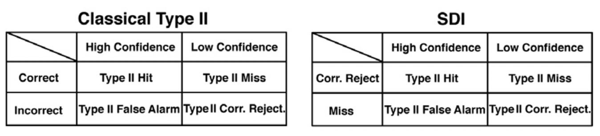

```{r setup, include=FALSE}
knitr::opts_chunk$set(echo = FALSE)
library(ggplot2) # for plotting graphs
library(citr) # for citation/reference management
library(tinytex) # for LaTex file compiling 
library(dplyr) # data manipulation
library(magrittr) # readable code (for operators etc.)
library(readr) # for reading data files (csv etc.)
library(tidyr) # for tidying data
library(data.table) # for data manipulation 
library(RColorBrewer) # provides color palletes for graph plotting 
library(papaja) # apa stype for reporting data
library(MOTE) # required package for use of 'papaja'
library(MESS) # statistical functions used in conjunstion with papaja
library(lmerTest) # for mixed effects model fit
library(broom.mixed) # to tidy model fit coefficients
getwd()
```
# 1.Abstract

# 2.Introduction 
As human beings we often make statements such as ‘I am confident that…’, reflecting the importance of confidence, which has wide applications in fields such as medical diagnosis, financial choices and eyewitness testimony etc.. Confidence can be defined as ‘a belief about the validity of our own thought, knowledge or performance that relies on a subjective feeling.’ [@grimaldi2015nbr]. The confidence of one decision can bear on another decision, such as when one decides to drop a stock investment after purchasing. The formation of confidence in human perception has been investigated extensively, with developments of various behavioural, neural and computational models.  

Traditionally, research investigating how confidence is formed with regards to perception commonly used detection and discrimination tasks, which are considered to represent the very basics of our perceptual abilities. A detection task requires to identify the presence of a stimulus (e.g. whether a dot is present or absent) whereas a discrimination task (sometimes labeled as categorization) requires to distinguish a target stimulus from other distractors based on certain features (e.g. whether the line is tilted to the left or the right). Although they are both perceptual tasks, evidence has suggested they can lead to differences in objective performance [e.g., @mack2010jephpp], which has been investigated extensively in past decades. Until recent years, with increasing popularity in investigating confidence formation, studies showed that detection and discrimination can also lead to distinctive subjective judgments of performance behaviourally ([@meuwese2014app]) and neuroimaging data suggested different neural representations associated with judging confidence in these two tasks [e.g., @mazor2020e]. Models that have been put forward to explain such differences can be broadly divided into two camps: 1.) Confidence judgments is a higher-order process that treats detection and discrimination distinctively due to the differences in the control of one’s internal state, such as attention; 2.) Behaviour and neural activities differ as a response to the physical features of detection and discrimination at the perceptual level such as amount of sensory evidence and confidence is formed through similar process for these two tasks.

The current project aims to explain the distinctive processes involved in confidence formation in detection and discrimination tasks from the perspective of Signal Detection Theory (SDT), using a new paradigm which includes a discrimination task with the features of detection task. This paradigm also sheds a light on our understanding of alternative models. The following section will first review behavioural and neuroimaging evidence showing differences in detection and discrimination tasks, then discuss some models that have been put forward to explain such differences and finally propose the hypothesis that distinctive patterns arise in forming confidence in the two tasks as a result of their different distributions of signal (target) and noise (distractor) based on SDT.   

## 2.1. Detection vs. Discrimination  
How do we detect and/or categorise something? Does one first detect something is there (e.g. ‘I saw something is there’) and then further categorize it to certain type (e.g. ‘The thing I saw is a car.’), or we know what it is immediately when we see something is there (e.g. ‘I saw a car there)? The level of independence of these two tasks has been the most commonly debated discussion regarding these two tasks [@mack2010jephpp; @grill-spector2005ps]. This is an important consideration for wide range of research themes, as it affects the flexibility of using these two tasks in the investigation of other domains such as confidence formation. Researchers advocate the view that detection and discrimination are two process happen simultaneously. 

On the other hand, @mack2010jephpp used a paradigm to assess the level of dependence of detection and discrimination at the basic-level (car vs. boats) and superordinate level (e.g. car vs. people). They found that detection and basic-level object categorisation is supported by single mechanism as their results revealed a dependence between the success for the detection task and the success for basic-level categorisation task. However, the success for one to correctly categorize a target at superordinate level is not dependent on the success at detection, which suggests distinctive mechanisms supporting detection and superordinate categorisation, thus again highlighting the importance of differentiating the two for future research. Findings from their research reflects the importance of distinguishing between different levels of stimuli, challenging the view of one underlying perceptual ability for, or at least strong dependence between detection and discrimination suggested previously by @grill-spector2005ps. 

A more prominent, and perhaps most elementary difference between detection and discrimination tasks is that the two alternative choices rely on asymmetrical sensory evidence for detection in contrast to symmetrical evidence for discrimination. In discrimination tasks sensory evidence is available for both alternative choices. On the other hand, in a detection task, virtually no sensory evidence is available for participants to make an absence decision, a feature that essentially makes up the definition of ‘absence’ in such tasks, in contrast to a present decision. This makes the “absence” condition in detection tasks a particularly interesting case. 

Absence can be defined as ‘the nonexistence or lack of’. The question is then how our brain encodes something that is not there and translate it into sensory experience which is later used for decisions. The absence of a stimulus is traditionally thought to be coded by the brain as baseline activity in contrast to more robust firing of neurons in the presence of a stimulus.  Contrariwise, when stimulus with strength on a continuing spectrum was shown, only those evoking activities beyond the threshold were considered to be perceived as present [@victordelafuente2005nn].  However, despite the lack of sensory evidence in absence conditions, recent evidence has suggested that neurons encode both stimulus absence and presence when dissociated from motor response [@katharinamerten2012pnas]. In their study, they found that prefrontal cortex (PFC) is recruited in rhesus monkeys during stimulus present trials as well as absence trials using single neuron recordings.  

A similar line of research has investigated the representation of ‘empty set’, which is the precursor for zero, in the brain. As trivial as this concept might appear, it actually makes up a fundamental part of the mathematical continuum that has not been investigated until recent decades [@rinaldi2016tics].  How does the brain react to an empty set, i.e. nothing in contrast to other numbers?  It has been shown that a group of neurons in the posterior parietal cortex of monkeys were activated in response to numerosity ‘zero’ in a numerical operation task [@sumitookuyama2015sr]. Furthermore, @sumitookuyama2015sr found two types of ‘zero’ neurons in the ventral intraparietal (VIP) area; an exclusive group that showed selective response to zero target in contrast to non-zero targets and a continuous group that encodes both zero and non-zero numerosities (from 0 to 4) with strength on a continuous spectrum. Their results showed the presence of active encoding of numerosity zero, i.e. empty set, despite treating it as a continuous or categorical variable. Similar results were found by [@ramirez-cardenas2016cb]. By training monkeys to perform a number matching task, they found that not only all recorded neurons in VIP area and prefrontal cortex responded to empty sets, some of them also discharged maximally to empty sets in comparison to other numerosities, i.e. zero selective, which constitutes an even higher proportion of VIP cells in comparison to findings from @sumitookuyama2015sr. 

Taking together those evidence, the lack of sensory inputs in “absence” or “zero” does not seem to stop neurons in the brain from responding. These findings challenge the traditional belief that neural activity is proportional to the strength of sensory inputs, while it remains unclear where those representations of ‘nothing’ arises from and what consequences they lead to.  One way to interpret the neural activities in response to ‘empty set’, for instance, is that they held explicit information of ‘nothing’ as working memory which is later used for the task as suggested by @sumitookuyama2015sr. Others have proposed that the lack of sensory signals leads brain to generate a quantitative representation of zero abstractly that is later positioned on a numerical continuum [@ramirez-cardenas2016cb]. Nonetheless, the uniqueness and level of cognitive demands required for representing nothing is unequivocal, which again potientially distinguishes detection tasks from discrimination tasks. This induces curiosity in understanding how subjective judgments are formed in these two tasks respectively. 

## 2.2. Forming confidence in detection and discrimination 
The term *subjective judgments* can entail extremely different measurements depending on the field of interests. An important aspect of subjective judgements in psychophysics is the level of confidence observers held towards their objective performances. Those confidence ratings are categorised as Type II report, which functions based on the assumption that participants would give high confidence ratings when they believed their choice was correct and low confidence ratings if they are less certain. The correspondence between Type I performance and Type II report reflects one’s ability to have insight into the objective correctness of their response, which is also known as one’s metacognitive sensitivity/accuracy [@fleming_relating_2010]. In contrast to rather substantial differences in objective performance across tasks, one’s metacognitive ability was found to remain relatively stable across different tasks which led to the notion of a general mechanism supporting metacognitive judgements [@song2011cac]. However, surprisingly our subjective judgements might not always reflect or can even contradict our objective behaviour and furthermore, can vary significantly between different types of task [@kanai2010cc]. 

The study by @kanai2010cc was one of the first to show that failure of visual perception is not always picked up by one’s subjective awareness. They used a detection task in which participants were asked to report the presence of the target stimuli. The stimuli were manipulated in six different ways to create six different conditions: contrast, backward masking, flash suppression, dual task, attentional blink and spatial uncertainty, which can be further categorized into attentional difficulty (dual task, attentional blink and spatial uncertainty) and sensory difficulty (contrast, backward masking and flash suppression). Participants then reported their confidence ratings of the correctness of their response after each trial. Beyond using the traditional Type II AUC performance as shown in Fig.1A, they developed a new measure termed Subjective Discriminability of Invisibility (SDI) to measure how accurate participants can adjust their ratings accordingly to their task performance. SDI was developed based on computing the Type II performance but only for misses and correct rejections, i.e. trials in which participants reports absence of the stimulus (Fig.1B). To compare the metacognitive sensitivity in six different conditions, the objective performance of participants was controlled around the level of 70% correct in analysis to avoid situations such as constantly high or low confidence ratings because the task is easy or difficult. The level of 70% correct response was chosen to ensure participants stayed motivated in these trials and they also made enough errors to calculate reliable SDI scores at the same time.

## MM: use relative paths, so that your script can be run on other machines too.


They found that SDI is significantly higher in attentional difficulty conditions compared to sensory difficulty conditions. In other words, participants can accurately judge whether their choice is a correct rejection or a miss when the difficulty arise as a result of increasing attentional demand whereas participants cannot distinguish a miss from correct rejection when the difficulty arise as a result of lacking sensory input. Therefore, the source of noise in perceptual tasks is an important consideration for observers to make confidence judgements; confidence is often adjusted accordingly when noises arises from one’s internal cognitive capacity such as lack of attention whereas the impact of the physical property/environment of perceptual stimuli is less recognised by observer.


More recently, @meuwese2014app found that metacognitive ability is higher in categorization/ discrimination task than in the detection task for both masked and degraded stimulus. All participants performed the detection and discrimination task, which require them to identify the presence of an animal (e.g. Was there an animal present?) or identify the category (e.g. Was the animal a cat?). The stimuli were either masked by textured patterns or degraded by means of phase scrambling. Participants were then asked to rate how confident they were about the correctness of the choice they made on a scale from 1 to 6. The objective performance in detection and discrimination were also matched at the level of 71% correct to control for the potential effect of objective performance on confidence judgement. Two measures were included for metacognition. One of them is the classic measure of metacognitive sensitivity, the area under the ROC curve. This measure reflects the consistency between subjective confidence ratings of responses made and the actual, objective performance. In addition, they also included the measure of Subjective Discriminability of Visibility (SDV), which includes only trials of hits and false alarms (i.e. trials in which participants reported a stimulus was present), and corresponding Subjective Discriminability of Invisibility (SDI),  which includes only trials of miss and correct rejections (i.e. trials in which participants reported a stimulus was absent).

They found that metacognitive sensitivity, according to the classic measure, is higher for discrimination than detection task (Fig.3). Participants can more accurately evaluate the correctness of their choice when the judgement is about which category the target belongs to than when the it is about whether a target was present. Further analysis revealed that such metacognitive superiority does not exist across whole discrimination task and was in fact, specific for correct rejections and misses, measured by SDI. To further unpack the elements driving the differences between detection and discrimination, the AUC for hits, misses, correct rejections, and false alarms were calculated separately. They found that lower metacognitive accuracy in detection compared with discrimination is driven by lower metacognitive accuracy for correct rejections, i.e. participants subjective judgements of their choice being correct is less accurate for an absence decision when it is physically not there compared with a choice of the stimuli not belonging to the target group when it actually doesn’t. Their results revealed several interesting aspects of confidence formations in these two tasks; people tend to have worse insight for detection than discrimination task, but only in situations where they have correctly rejected the target. 

Consistent with findings in @meuwese2014app, @arielezylberberg2012fin]found that observers were only influenced by sensory evidence in favour of the selection they made when forming confidence judgments, while the sensory evidence for the unselected choice is irrelevant for such judgments. Although this is only investigated in two discrimination tasks, luminance comparison and random dot motion task, it might provide an explanation for the poor metacognitive performance in detection task. Consider the situation where participants have made a correct “absence” decision, their confidence rating would be in theory be strongly influenced by evidence in favour of this choice according to the findings from Zylberberg, but the lack of sensory evidence in such cases might underlie a disturbance to a more conventional confidence formation process that is engaged in present trials or discrimination trials. Although it is unclear what the consequences of such disturbance are, e.g. does this give rises to the employment of alternative processes such as counter-factual reasoning (discussed in section 2.4 below) specific for absent trials, the uniqueness of confidence formation in absent trials in detection is clear. 

Therefore, given the finding that participants were strongly influenced by the evidence for selected choice, in detection, virtually no sensory evidence is available in absence trials to support confidence judgements, posting a disadvantage for metacognitive accuracy. Broadly, these studies have shown that it is easier to be confident when something is simply not part of the target group than when something is not there at all. 

## 2.3. Computational models of confidence in decision making
The interest in studying confidence formation have extended to developments of computational models. It is widely accepted that human confidence report reflects a Bayesian probabilistic estimation of a choice being correct. To test this assumption, @adler2018pcb compared the fit of several models for forming confidence including the Bayesian model and Non-Bayesian alternatives using two categorisation tasks.The tasks essentially require the participants to report whether the stimulus shown is a visual grating or ellipse, as well as the level of confidence in their choices simultaneously in one press. The contrast of the grating and elongation of the ellipse were manipulated to give rise to the measure of stimuli reliability and corresponds to the level of sensory uncertainty. Their study included two variations of the task such that in task A the two types of stimuli are drawn from Gaussian distributions with different means but same SD, whereas in task B the stimuli are drawn from Gaussian distributions with different SD but same means. The consequence of such manipulation is that in task A, stimuli around tilted to certain direction are more likely to be from gabor category, whereas in task B, stimuli around the horizontal are more likely to be from the gabor category. 

An ideal Bayesian observer would make a decision by computing a posterior probability of choosing category c given measurement _x_, _p(c|x)_, which is equivalent to the positive log posterior ratio $d=\frac{{p(c=1|x)} }{{p(c=1|x)}}$. The differences in the structure of task A and B have an impact on how Bayesian observers make decisions based on computing this posterior probability such that in task A, participants report stimuli belongs to category 1 when measurement x is positive whereas in task B participants needs both x and trial-by-trial sensory uncertainty to make optimal decisions. 

They found that participants’ confidence reports do not reflect a probability of a choice being correct in a completely Bayesian way but rather a heuristic approximation of this choice being correct. Subjects however do take into account the sensory uncertainty, the perquisite of Bayesian reasoning. From model fit results, it was suggested that participants use the knowledge of their sensory uncertainty over a category, without computing a Bayesian posterior distribution described above but rather subjects base their response on a maximum a posteriori (MAP) estimate of orientation (using the mixture of the two stimulus distributions as a prior distribution). Models that do not include sensory uncertainty, e.g. fixed models provide a poor fit for the data. Bayesian model does not fully account for the behavioural results and among all models, heuristic models incorporating uncertainty in a non-Bayesian way is a better fit for their results, which suggests that observers do take into account of uncertainty when forming confidence judgements but in a non-Bayesian manner.

## 2.4. Neural basis of forming confidence 
What brain regions support the formation of metacognitive judgements? Studies have shown a rostrolateral and dorsolateral prefrontal cortices (PFCs) are key brain areas for metacognition in human [@fleming_relating_2010; see @fleming2012ptrsb for a review]. Miyamato et al. (2018) found that area 10 is also recruited for metacognitive evaluation of non-experienced events in macaque monkeys and the frontopolar cortex plays a causal role to confer awareness of non-experienced events.

Given the behavioural studies described above showing different confidence judgement formation in discrimination and detection, it is reasonable to expect distinctive neural representations supporting these judgements. @mazor2020e investigated the neural contributions to confidence judgements in detection and discrimination. Participants were asked to judge whether a grating was present (detection) or the orientation of a grating (discrimination), after which they reported their confidence ratings. They found distinct neural representations of confidence in detection and discrimination. Specifically, a more pronounced quadratic effect of confidence was observed in the frontopolar cortex (FPC) in the detection task compared with the discrimination task. In their study, they proposed two different approaches to explain this pattern which will be discussed below.  

## 2.5. Counterfactual-reasoning model for confidence formation
One explanation for the findings from @mazor2020e concerns the qualitative differences of detection and discrimination, and more specifically, the unique role of counterfactual reasoning and its interaction with one’s attentional state in detection. Due to the lack of sensory input for absence trials, participants might instead refer to their perceived likelihood of having detected a hypothetical target i.e. the counterfactual situation, in order to make confidence rating for target absence. According to this account, the differences of FPC activations in detection and discrimination might reflect a role of this area in referring to an internal hypothetical state. This process is expected to be influenced by their current state of attention: participants are likely to give low confidence ratings when they evaluate themselves as less attentive as their judgements about the possibility of the counterfactual situation is less certain and vice versa. Behavioural results have supported a role of attention monitoring in subject awareness of performance [@kanai2010cc]. People seem to be able to distinguish their correct rejections from misses when the task difficulty arises from competing attention resources in contrast to when it arises from lack of sensory input. In discrimination task, it is also found that uncertainty related to attention influences observers’ categorization performance and confidence rating in a Bayesian style [@denison2018pnasusa]. Therefore, the process of a counterfactual reasoning is likely in the absence trials for detection.  

However, it is important to note here that such counterfactual model incorporating attentional control could only account for distinct activations of FPC in ‘No’ responses whereas @mazor2020e found similar pattern in ‘Yes’ trials as well. Further investigations are therefore needed to confirm the role of counterfactual reasoning in detection and discrimination. 

## 2.6. SDT Model for confidence formation
Another explanation based on Signal Detection Theory (SDT) concerns the quantitative differences in these tasks. In a detection task, the sensory evidence for two competing choices is unequally distributed, with a greater variance in the presence trials than the absence trials (Fig.1b) as theoretically no sensory stimulus is available in absence trials. In contrast, in a typical discrimination task the two alternatives are equally distributed (Fig.1a). According to the likelihood-ratio calculation of decision making for a binary task, $log(\frac{l(h1)}{l(h2)})$ ,equal distribution implies a linear function of log likelihood-ratio calculation in comparison to a quadratic function from an unequally distributed sample [@wickens2002]. Therefore, a more pronounced quadratic effect of confidence in FPC in the detection task might arise as a result of activation in this area representing the relative likelihood of committing to ‘Yes’ or ‘No’ responses drawing from unequally distributed evidence, whereas it is linear when neurons were representing the relative likelihood of ‘Left’ or ‘Right’ drawing from equally distributed evidence. In line with this model, a discrimination task with the attributes of unequally distributed evidence for two alternatives as that in a detection task would also lead to similar quadratic effects of confidence modulation in FPC.

Similar first order model was put forward before to explain the process of forming subjective reports based on SDT and Bayesian inference (King & Deane, 2012). They consider second order judgements to be made based on the same inferential process as the first order judgments that is influenced by the strength of the sensory stimuli. According to their model, the content of conscious perception is the outcome of an inferential decision process, influenced by the stimuli inputs, with a rich set of different output classes that have incorporated subjective judgements such as confidence, rather than a simple present or absent decision (see fig.4 below). 
The common ground for those first order models that distinguish them from second order models such as counter-factual reasoning model is that subjective reports were made via the same level of cognitive process as first order judgements without involving higher order state space. 


## 2.7. The current study 
To untangle the counterfactual and SDT models described above, the current study includes another discrimination task with unequal distributions (Fig.4C) in addition to a detection and a discrimination task that are typically used in psychophysics. This will allow us to separate the quantitative feature of the task, i.e. type of distribution, from the qualitative ones, i.e. type of task. We propose an experiment paradigm including three perceptual tasks while participants’ brain activations are being monitored in an MR scanner: A). discrimination task with equal variance (whether gratings are tilted to the right or left; B). detection task with unequal variance (whether a grating is present or not); C). discrimination task with unequal variance (whether a stimulus is a vertical grating or tilted towards any direction). Participants are asked to rate their confidence about their decision following each trial. If quadratic effects of confidence on brain activations are observed in both the discrimination task with unequal variance and the detection task, it is likely that neurons in this area represent the relative likelihood of two competing choices in perceptual tasks as predicted by the SDT model. On the other hand, if the discrimination task with unequal variance shares a similar linear activation profile with the equal-variance discrimination task, it would suggest that the difference in neural representations of detection and discrimination is driven by some more qualitative features of detection, such as counterfactual reasoning proposed in current study. 


## 2.8. Aims and Hypothesis
The current study aims to study how human form confidence in detection and discrimination tasks both from behavioural and neural perspectives. Specifically, this project aims to:

* Compare the confidence formation pattern of the new tilt recognition task with detection and discrimination.

* Replicate the finding from [@mazor2020e] that an interaction between task (discrimination/detection) and the quadratic effect of confidence, in medial and lateral frontopolar cortex, as well as in the STS and preSMA.

* Replicate the finding from [@mazor2020e] of an interaction between detection response (present/absent) and the linear effect of confidence in the right TPJ. 

* Compare the quadratic effect of confidence in the tilt-recognition task with the quadratic effect of confidence in the detection and discrimination tasks in the frontopolar cortex, the STS and the pre-SMA.

* Compare the response-specific linear effects of confidence in the tilt- recognition task with the response-specific linear effects of confidence in the detection and discrimination tasks in the right TPJ.

# 3.Method 
## 3.1. Overview
The current study involved two parts: a behavioural training session lasting around 60 mins and a scanning session lasting around 90 mins with intervals no longer than two weeks. Both parts of the experiments took place at the Wellcome Centre for Human Neuroimaging, University College London. The scanning session was conducted in the 3 Tesla MRI scanner. The ethics of the current study was approved by XX. 

## 3.2. Participants
XX healthy participants were recruited, xx completed the behavioural training session and xx completed the scanning session. According to the preregistration exclusion criteria (see section 3.6. below for details), in total data from 25 participants were included in the final analysis. Participants received cash payments as compensation for their time, £10 for the behavioural session and £20 for the scanning session. To motivate participants to perform their best in our tasks, we also offered bonus payment for good performance and accurate confidence ratings (see procedure below for details on bonus calculation).  
 
## 3.3. Experimental Procedure 
### 3.3.1. Behavioural session
During behavioural training session, participants first received introductions of the study, including general procedure, ethic and data protection protocols. The structure of the three tasks (see fig.4 for the schematic representation) were explained to participants as following:

* Detection task: On half of the trials, a noisy grating will appear after the fixation cross and on the other half there would be no grating shown and you need to decide whether there was a grating present.

* Discrimination task: A grating will appear on the screen every few seconds after the fixation cross, which will be tilted clockwise in half of the trials and anticlockwise in other half. Participants were asked to decide which direction the grating was tilted to. 

* Tilt recognition task: A grating will appear on the screen every few seconds after the fixation cross, which will be tilted (to any direction) in half of the trials and vertical in other half. Participants were asked to decide whether the grating was tilted or vertical. 

* Confidence rating: In all three tasks, immediately after making a choice, you need to indicate how confident you are in your decision by changing the size of the circle.

This session contains a practice block, a calibration block and several training blocks for all three tasks. The response mapping will be counterbalanced between blocks, such that an index finger press will be used to indicate a clockwise tilt on half of the trials, and an anticlockwise tilt on the other half. Similarly, in half of the tilt recognition trials the index finger will be mapped to a vertical response, and on the other half to a tilted response. Lastly, in half of the detection trials the index finger will be mapped to a yes (‘target present’) response, and on the other half to a no (‘target absent’) response. To avoid size-related effect on confidence rating, participants were divided into two groups such that for half participants bigger circle corresponds to higher confidence level and for the other half smaller circle corresponds to higher confidence level.

During this session, each participants performance was controlled around 70 % accurate, by manipulating the task difficulty independently for the three tasks. This will be achieved by using the common 1 up 2 down staircase procedure on stimulus visibility (discrimination and detection task) and on the standard deviation of the orientation distribution (tilt recognition). Participants were not invited back to continue the scanning session if: 1.) their accuracy were lower than 60% or higher than 80%; 2.) had strong response bias, i.e. used the same response in more than 80% of the trials; 3.) had strong confidence bias, i.e. the same confidence level was reported for more than 90% of the trials. 

### 3.3.2. Scanning session
The structure of the three tasks were the same as behavioural session. To motivate participants perform we offered bonus in addition to the baseline payment for the scanning session.  Bonus is calculated use following rule:		
bonus=£$\frac{\overrightarrow{accuracy}.\overrightarrow{confidence}}{200}$. Where $\overrightarrow{accuracy}$ is a vector of 1 and -1 for correct and incorrect responses, and $\overrightarrow{confidence}$ is a vector of integers in the range of 1 to 6, representing confidence reports for all trials. The rule for bonus calculation was explained to participants in both sessions. The scanning session started with a calibration phase to further calibrate participants performance during which time the structural scan for each participant was also obtained. At scanning, 10 discrimination and detection blocks were presented in 5 scanner runs. 

## 3.4. Stimulus
After a temporal rest period of 500-4000 milliseconds, each trial will start with a fixation cross (500 milliseconds). The target was then presented on the screen for 500 milliseconds. In all three conditions, stimuli will consist of 10 grayscale frames presented at 20 frames per second within a circle of diameter 3°. Stimuli will be generated in the following way:

* Generate 10 grayscale frames ( _F_ ... _F_ ), each an array of 142 by 142 random luminance values.
* Create a 142 by 142 sinusudial grating ( 24 pixels per period, random phase). The orientation of the grating is determined according to the trial type.
* The grating visibility for frame _i_ is _pi_ = _v_ × _exp_(-$|\textit{i}-5|$/2) with _v_ being the visibility level in this trial (0 for target-absent trials).
* For each pixel in the frame , replace the luminance value for this pixel with the luminance value of this pixel in the grating with a probability of.

## 3.5. Scanning parameters 
Scanning took place at the Wellcome Centre for Human Neuroimaging, London. The structural images were obtained using an MPRAGE sequence (1x1x1 _mm_ voxels, 176 slices, in plane FoV = 256x256 _mm_ 2), followed by a double-echo FLASH (gradient echo) sequence with TE1=10ms and TE2=12.46ms (64 slices, slice thickness = 2 _mm_, gap = 1 _mm_, in plane FoV= 192×192 _mm_ 2, resolution = 3×3 _mm_ 2) that were later used for field inhomogeneity correction. Functional scans were acquired using a 2D EPI sequence, optimized for regions near the orbitofrontal cortex (3.0x3.0x3.0 _mm_ voxels, TR=3.36 seconds, TE = 30 ms, 48 slices tilted by -30 degrees with respect to the T¿C axis, matrix size = 64x72, Z-shim=-1.4).

```{r tidy data, include=FALSE, cache=TRUE}
# open file
data <- read.csv("data.csv")

# creat a new file with only included trials+ transform rt into log_rt
data_valid <- data %>% 
  #Filter out the excluded trials 
  filter(inclusion==1) %>%
  filter(! response=="NaN") %>%
  mutate(rt=response_time*1000) %>%
  mutate(log_rt=log(rt))
data_valid

# change response codes
data_valid$response[(data_valid$response=="0") &
                                   data_valid$task=='Detection'] <- "No"

data_valid$response[(data_valid$response=="1") &
                                   data_valid$task=='Detection'] <- "Yes"

data_valid$response[(data_valid$response=="0") &
                                   data_valid$task=='Discrimination'] <- "Anticlockwise"

data_valid$response[(data_valid$response=="1") &
                                   data_valid$task=='Discrimination'] <- "Clockwise"

data_valid$response[(data_valid$response=="0") &
                                   data_valid$task=='Tilt'] <- "Vertical"

data_valid$response[(data_valid$response=="1") &
                                   data_valid$task=='Tilt'] <- "Tilted"

# create a tidy version of data file
data_tidy <- rename(data_valid, c('rTPJ'='BOLD_rTPJ', 'vmPFC'='BOLD_vmPFC', 'FPl'='BOLD_FPl', 'FPm'='BOLD_FPm', 'pMFC'='BOLD_pMFC'))
data_tidy <- gather(data_tidy, "ROI", "BOLD", 16:21)%>% filter(!BOLD=="NaN")

# separate the data for each task respectively
data_det <- data_valid %>%filter(task=="Detection")
data_dis <- data_valid %>%filter(task=="Discrimination")
data_til<- data_valid %>%filter(task=="Tilt")

# get the total number of participants
no_subj <- length(unique(data_valid$subj_id))

# count the total no of trials for each task for each participant
total_trials <- data_valid %>% group_by(subj_id, task) %>% summarise(totaltrials=(count=n()))

#get the number of trials for each participants where the stimulus shown is 1 (i.e.Present, Clockwise & Tilted)
sti_trials <- data_valid %>% group_by(subj_id, task) %>%filter(stimulus=="1")%>%summarise(sti_trials=(count=n()))


#count no. of correct trials for each task for each participant
individual_trials <- data_valid %>% 
  #group by ID, type of task and accuracy
  group_by(subj_id, task, accuracy) %>% 
  #count number of correct/incorrect/NAH trials 
  summarize(no_trials=(count = n())) %>%
  #combine with the total data frame
  inner_join(total_trials, by = c ("subj_id","task")) %>%
  mutate(proportion = no_trials / totaltrials)

#display accuracy 
individual_accuracy <- individual_trials %>% filter(accuracy==1) %>%rename(correct=proportion)

```

# 4.Results
## 4.1.Performance across threee tasks
```{r, include=FALSE, cache=TRUE}
#display accuracy for each task 
task_accuracy <- individual_accuracy %>% group_by(task) %>% summarise(mean(correct)) %>% spread(key='task', value='mean(correct)')

#ANOVA comparing task performance 
aov.Mean_accuracy <- aov(correct~task,data=individual_accuracy)

#############################
#calculating HIT and FA rate
#############################

#count the number of accurate/inaccurate trials for each response for each task & combine with the sti_trials data frame
trials <- data_valid %>% 
  #group by ID, type of task and accuracy
  group_by(subj_id, task, accuracy, response) %>% 
  #count number of correct/incorrect/NAH trials 
  summarize(no_trials=(count = n())) %>%
  inner_join(sti_trials, by = c ("subj_id","task"))

# trabsfor trials into dta table and inclue only positive responses for three tasks
dt  <- data.table(trials)%>% filter(response=="Yes"| response=="Tilted"| response=="Clockwise")
# calculate the z value for hit and fa 
rate_subj <- dt[, .(rate=no_trials/sti_trials), by=.(subj_id,response, accuracy)] %>% mutate(z_rate=qnorm(rate))  

# drop the rate column (for later spreading to work)
rate_subj$rate <- NULL

# spread the file based on accuracy (i.e. HIT and FA respectively)
rate_subj <- spread(rate_subj,key='accuracy', value='z_rate')  
colnames(rate_subj) <- c("subj_id", "response", "z_FA", "z_HIT")

# d prime for each subjects and task
d_subj <- rate_subj[, .(d_prime=z_HIT-z_FA), by=.(subj_id,response)]

# d prime for each task
d_task <- d_subj[, .(mean_d=mean(d_prime)), by=.(response)] 

#ANOVA Calculation for d prime
aov.d <- aov(d_prime~task, data=d_subj)

###########################
#response bias calculation
###########################
response <_ data_valid %>% 
  #group by ID, type of task and accuracy
  group_by(subj_id,task, response) %>% 
  #count number of correct/incorrect/NAH trials 
  summarize(no_trials=(count = n())) %>%
  #combine with the total data frame
  inner_join(total_trials, by = c ("task","subj_id")) %>%
  mutate(probability = no_trials / totaltrials)


#response bias for detection
det_resp <- response %>% filter(task=="Detection") %>%filter(response=="1")

det_bias <- mean(det_resp$probability)
sd_bias1 <- sd(det_resp$probability)
detection<- (rnorm(no_subj, mean = det_bias, sd = sd_bias1))

t_det <- t.test(detection, mu = 0.5) # Ho: mu = 0.5

#response bias for discrimination
dis_resp <- response %>%
  filter(task=="Discrimination") %>%
  filter(response=="1")
dis_resp

dis_bias <- mean(dis_resp$probability)
sd_bias2 <- sd(dis_resp$probability)
discrimination<- (rnorm(no_subj, mean = dis_bias, sd = sd_bias2))
t.test(discrimination, mu = 0.5) # Ho: mu = 0.5

#response bias for tilt recognition
til_resp <- response %>%
  filter(task=="Tilt") %>%
  filter(response=="1")
til_resp

til_bias <- mean(til_resp$probability)
sd_bias3 <- sd(til_resp$probability)
tilt<- (rnorm(no_subj, mean = til_bias, sd = sd_bias3))
t.test(tilt, mu = 0.5) # Ho: mu = 0.5

#####################
#calculating rt
#####################
rt <- data_valid %>%
  group_by(subj_id, task, response, accuracy) %>%
  summarise(median(rt)) %>%
  rename("median_rt"="median(rt)")

#calculating median rt for correct and incorrect trials
rt_accuracy <- rt %>%
  group_by(accuracy) %>%
  summarise(median(median_rt)) %>%
  rename("median_rt"="median(median_rt)") 

rt_accuracy$accuracy[rt_accuracy$accuracy=="0"]<-"incorrect"
rt_accuracy$accuracy[rt_accuracy$accuracy=="1"]<-"correct"

#calling out median rt for correct and incorrect trials
getmedian <- rt_accuracy$'median_rt'
names(getmedian) <-rt_accuracy$accuracy

#calling out quantiles of rt for correct and incorrect trials
correct_trials <- rt %>% filter(accuracy==1)

incorrect_trials <- rt %>% filter(accuracy==0)

qt_correct <- quantile(correct_trials$median_rt, c(.25,.5,.75))
qt_correct <- quantile(incorrect_trials$median_rt, c(.25,.5,.75))

#get t test results detection, discrimination and tilt 
tdet <-t.test(log_rt~response, mu=0, alt="two.sided", conf=0.95,var.equal=TRUE, data=Data_Det)
tdis <-t.test(log_rt~response, mu=0, alt="two.sided", conf=0.95,var.equal=TRUE,data=Data_Dis)
ttil <-t.test(log_rt~response, mu=0, alt="two.sided", conf=0.95,var.equal=TRUE,data=Data_Til)

```

Detection (accuracy= `r printnum(task_accuracy$Detection)`, d'= `r apa(d_det, 2, T)`),  discrimination (accuracy= `r printnum(task_accuracy$Discrimination)`, d'= `r apa(d_dis, 2, T)`) and tilt recognition (accuracy = `r printnum(task_accuracy$Tilt)`, d'= `r apa(d_til, 2, T)`) was similar. A one-way ANOVA failed to detect a significant difference between the accuracy of these three tasks `r apa_print(aov.Mean_accuracy)$full_result$task` and d' (F= `r apa(F2, 2, T)`, p= `r apa(p2, 2, T)`; see Figure \ref{fig:accuracy})).

The probability of responding Yes in detection was `r apa(print(det_bias), 2, T)` (± `r apa(sd_bias1, 2, T)`), and was significantly different from 0.5 (ADD T TEST RESULTS). The probability of responding CLOCKWISE was `r apa(dis_bias, 2, T)` (± `r apa(sd_bias2, 2, T)`) and was not significantly different from 0.5. For the tilt recognition task, the probability of responding TILTED was (`r apa(til_bias, 2, T)` ± `r apa(sd_bias3, 2, T)`).

Response time was faster for correct response (1st quartile= `r apa(qt1_correct, 2, T)`, median= `r apa(unname(getmedian['correct']), 2, T)`, 3rd quartile= `r apa(qt3_correct, 2, T)` milliseconds) than incorrect responses (1st quartile= `r apa(qt1_incorrect, 2, T)`, median= `r apa(unname(getmedian['incorrect']), 2, T)`, 3rd quartile= `r apa(qt3_incorrect, 2, T)` milliseconds). A one-way analysis of variance failed to detect a significant overall effect of responses type in detection (Yes vs. NO, t=`r apa(tdet, 2, T)` p=`r apa(p.det, 2, T)` ), discrimination (CLOCKWISE vs. ANTICLOCKWISE, t=`r apa(tdis, 2, T)`, p= `r apa(p.dis, 2, T)`) and tilt recognition (VERTICAL vs. TILTED, t=`r apa(ttil, 2, T)`, p= `r apa(p.til, 2, T)`) on response time.

```{r, accuracy_figure, echo=FALSE, message=FALSE,fig.cap="\\label{fig:accuracy} Mean accuracy across three tasks", cache=TRUE}
## MM: note how I've included fig.cap in the header, to include a caption and also a label (fig:accuracy) that we can later reference in the text.
number_ticks <- function(n) {function(limits) pretty(limits, n)}
data <- individual_accuracy
ggplot(data, mapping = aes(x= task, y=correct)) + ylim(0.4, 1) +labs (y="mean accuracy")+ theme_classic() +
   geom_boxplot()+ geom_jitter(position=position_jitter(width=.1, height=0), alpha=0.3, size=4) + scale_y_continuous(breaks=number_ticks(6), limits=c(0.4, 1)) + geom_hline(yintercept=0.5, linetype="dashed", color = "black") + theme(plot.title = (element_text(color = "black", size = 12, face = "italic")))
```

```{r include=FALSE, cache=TRUE}
#mean confidence frequency 
# MM: instead of creating three different dfs, I kept everything in one df here:
confidence_distribution <- data_valid %>%
  group_by(task,confidence,response) %>%
  summarise(no_trials=(count=n())) %>%
  mutate(frequency = no_trials / no_subj)
confidence_distribution

t_conf_det <- t.test(confidence~response, mu=0, alt="two.sided", conf=0.95, data = data_det)
t_conf_til <- t.test(confidence~response, mu=0, alt="two.sided", conf=0.95, data = data_til)

```
&nbsp;

## 4.2.Confidence distributions
Within detection, a significant difference in mean confidence was observed between Yes (target present) and NO (target absent) responses (see Fig.4 above) (t=`r apa(t1, 2, T)`, p = `r apa(p1, 2, T)`) , such that participants are more confident in their Yes responses than NO response and a statistical significance was also observed in the tilt recognition task between TILTED and Vertical response (t=`r apa(t3, 2, T)`, p = `r apa(p3, 2, T)`; see Figure \ref{fig:confidence}).

```{r echo=FALSE, message=FALSE, fig.cap="\\label{fig:confidence} Confidence distributions across three tasks and responses. Error bars represent the standard error of the mean.", cache=TRUE}

#SE calculation  (the standard deviation divided by the square root of the sample size)
#se <- function(x) sqrt(var(x)/length(x))
pd <- position_dodge(0.5) # move them .05 to the left and right
ci <- se(confidence_distribution$frequency)
         
#plot the frequency of confidence ratings for all three tasks
task_labs = c('Detection','Discrimination','Tilt Recognition')
names(task_labs) = c('Detection','Discrimination','Tilt')
cbPalette <- c("#e41a1c", "#377eb8","#4daf4a", "#984ea3","#999999","#f781bf")

confidence_det <- ggplot(confidence_distribution, mapping = aes(x = confidence, y= frequency, fill= response)) +
  geom_bar(stat="identity", width = 0.65, position = position_dodge(width = 0.7))+ scale_fill_manual(values=cbPalette) + theme_classic() + labs(title="Confidence by task and response", y="frequency")+ scale_x_continuous(breaks=number_ticks(6)) +ylim(0,30)+
  theme(plot.title = (element_text(color = "black", size = 12, face = "italic")))
confidence_det+facet_grid(rows=vars(task),
                          labeller = labeller(task=task_labs))
```
&nbsp;

&nbsp;
``` {r Type 2 ROC, echo=FALSE, message=FALSE, }
#get the total number of trials for correct vs incoccrect for each response respectively 
acc <- data_valid %>%
  group_by(subj_id, task, accuracy, response) %>%
  summarise(acc_trials=(count=n())) 
acc

#get the total number of trials for correct vs incoccrect for each response respectively at each confidence rating
conf <- data_valid %>%
  group_by(subj_id, task, accuracy, response, confidence) %>%
  summarise(conf_trials=(count=n())) %>%
  inner_join(acc, by = c ("subj_id","task", "response", "accuracy")) %>%
  mutate(prob=conf_trials/acc_trials)
conf

# combine with response dt (with no. trials for each response) + calculate the prob of giving each conf rating in that response (correct vs. inccorect) for each subject

# calculate the mean prob &se for the group
prob <- data.table(conf)
prob_response <- prob[, .(prob_mean=(sum(prob)/no_subj), prob_se=(se(prob))), by=.(task, response, accuracy, confidence)] 

#sort the df order
prob_response <- prob_response[order(task, response, accuracy, -confidence),]

# get the cumulative prob for each task & response & accuracy 
prob_cum <- data.table(prob_response)
cum_prob <- prob_cum[, .(cum_prob=cumsum(prob_mean), confidence, prob_se), by=.(task, response, accuracy)]%>%             
  #add the origin(0,0) point for each task on ROC plot
  add_row(task = "Detection", response= c("Yes", "No","Yes", "No"), confidence = 7, accuracy=c(0,0,1,1), cum_prob=0, prob_se=0)%>% add_row(task = "Tilt", response= c("Tilted", "Vertical","Tilted", "Vertical"), confidence = 7, accuracy=c(0,0,1,1), cum_prob=0, prob_se=0)%>% add_row(task = "Discrimination", response= c("Clockwise", "Anticlockwise","Clockwise", "Anticlockwise"), confidence = 7, accuracy=c(0,0,1,1), cum_prob=0, prob_se=0) %>% pivot_wider(names_from = accuracy, values_from = c("cum_prob", "prob_se"))

```

## 4.4.Metacognitive sensitivity
Metacognitive sensitivity, which is quantified as the area under Type 2 ROC curve (see    \ref{fig:type2 ROC} ), is significantly higher for Yes (`r apa(unname(auc_det['Yes']), 2, T) `) than No (`r apa(unname(auc_det['No']), 2, T)`) response. Similar pattern is observed in the tilt recognition task, where the AUC is significantly higher for Tilted (`r apa(unname(auc_til['Tilted']), 2, T)`) than Vertical (`r apa(unname(auc_til['Vertical']), 2, T)`) responses. This suggest that participants confidence ratings are more diagnostic to accuracy in the judgments of a target stimulus being pressent than being absent. Similarly, the correct judgments of a stimulus being tilted is better reflected by partcipants' confidence ratings than the correct judgments of a stimulus being vertical. 

```{r echo=FALSE, message=FALSE, fig.cap="\\label{fig:type2 ROC} Type 2 ROC curve for each task.", cache=TRUE, fig.width=3.2, fig.height=3.2}
#################################### 
# Plotting type 2 ROC
####################################
color_scheme <- tibble(Detection=c("#e41a1c", "#377eb8"), 
                       Discrimination=c("#984ea3", "#4daf4a"),
                       Tilt=c("#999999","#f781bf"))

roc_plot <- function(cur_task, df){
  
  # only include data for current task
  df <- df%>%filter(task==cur_task)
  
  plot<-ggplot(data=df, aes(x=cum_prob_0, y=cum_prob_1)) +
  geom_line(aes(colour = factor(response))) +
  geom_point(aes(color = factor(response)), size = 3) + 
  geom_errorbar(aes(ymin=cum_prob_1-prob_se_1, ymax=cum_prob_1+prob_se_1, colour = factor(response))) +
  geom_errorbarh(aes(xmin=cum_prob_0-prob_se_0, xmax=cum_prob_0+prob_se_0,colour = factor(response))) +
  scale_color_manual(values=color_scheme[[cur_task]]) +
  labs(title=paste('Type 2 ROC', cur_task), x= "p(conf | incorrect)", y="p(conf | correct)", color="Response") +
  theme_classic() + scale_x_continuous(limits = c(0, 1),breaks=number_ticks(6)) + scale_y_continuous(limits = c(0, 1), breaks=number_ticks(6)) +
  theme(legend.position=c(0.7, 0.15),  
                 legend.background = element_blank(),
        legend.title = element_blank(),
                 legend.key = element_blank(), 
        legend.text = element_text(size=10, face="bold"),
        plot.title = (element_text(color = "black", size = 12, face = "italic"))) +
  geom_segment(x = 0, y = 0, xend=1, yend=1, linetype="dashed")
  
  print(plot)
}

for (task in list('Detection','Discrimination','Tilt')) {
    print(task)
    roc_plot(task,cum_prob)
  }

```

&nbsp;

&nbsp;

## 4.5.BOLD signal in ROIs
```{r echo=FALSE, results = FALSE, message=FALSE, warning=FALSE, fig.width=2.5, fig.height=3.2, cache=TRUE}
#############################
# BOLD & rt data preparation 
#############################
data_BOLD <- data_valid %>%
  filter(! BOLD_rTPJ=="NaN")
data_BOLD

subj_BOLD <- unique(data_BOLD[,1])

#get the mean activation at each ROI for each participants at each confidence level for each response
data_BOLD_subj <- aggregate(data_BOLD[, 16:23], list(data_BOLD$subj_id,data_BOLD$confidence, data_BOLD$response, data_BOLD$accuracy, data_BOLD$task ), mean)

data_BOLD_subj <- rename(data_BOLD_subj,c('subj_id'='Group.1', 'confidence'='Group.2', 'response'='Group.3', 'accuracy'='Group.4', 'task'='Group.5'))

#get the group mean of activation for each ROI
data_BOLD_mean <- aggregate(data_BOLD_subj[, 6:13], list(data_BOLD_subj$confidence, data_BOLD_subj$response, data_BOLD_subj$accuracy, data_BOLD_subj$task), mean)

#get the se of activation for each ROI
data_BOLD_se <- aggregate(data_BOLD_subj[, 6:13], list(data_BOLD_subj$confidence, data_BOLD_subj$response, data_BOLD_subj$accuracy, data_BOLD_subj$task), se) 

data_BOLD_se <- rename(data_BOLD_se,c('rTPJ_se'='BOLD_rTPJ', 'vmPFC_se'='BOLD_vmPFC', 'pMFC_se'='BOLD_pMFC','FPm_se'='BOLD_FPm', 'FPl_se'='BOLD_FPl', 'preSMA_se'='BOLD_preSMA', 'rt_se'='rt', 'log_rt_se'='log_rt'))

#combine with mean df==> ".x==mean, .y==se"
data_BOLD_group <- inner_join(data_BOLD_mean, data_BOLD_se, by=c("Group.1", "Group.2", "Group.3", "Group.4"))

#rename the colum names 
data_BOLD_group <- rename(data_BOLD_group,c('confidence'='Group.1', 'response'='Group.2', 'accuracy'='Group.3','task'='Group.4'))

BOLD_det_mean <- subset(data_BOLD_group, response=="Yes"| response=="No")
BOLD_dis_mean <- subset(data_BOLD_group, response=="Clockwise"| response=="Anticlockwise")
BOLD_til_mean <- subset(data_BOLD_group, response=="Tilted"| response=="Vertical")

```

```{r echo=FALSE, results = FALSE, message=FALSE, warning=FALSE, fig.width=3.5, fig.height=4}
##########################
# Plotting log_rt 
#########################
rt_det <- ggplot(data=BOLD_det_mean, aes(x=confidence, y=log_rt)) +
  geom_line(aes(colour = factor(response))) +
  geom_point(aes(color = factor(response)), size = 3) + 
  geom_errorbar( aes(ymin = log_rt-log_rt_se, ymax = log_rt+log_rt_se, colour = factor(response)), width = 0.1)+
  scale_color_manual(values=c("#e41a1c", "#377eb8")) +
  labs(title="log rt Detection", x= "confidence", y="mean RT", color="Response") +
  theme_classic() + 
  scale_x_continuous(limits = c(0.5, 6),breaks=number_ticks(6)) + 
  theme(legend.position=c(0.8, 0.9),  
        legend.background = element_blank(),
        legend.key = element_blank(),
        legend.title = element_blank(),
        legend.text = (element_text(size = 10)),
        axis.text=(element_text(size=14)),
        axis.title=(element_text(size=14,face="bold")),
        plot.title = (element_text(color = "black", size = 14, face = "bold.italic"))) 
rt_det

rt_dis <- ggplot(data=BOLD_dis_mean, aes(x=confidence, y=log_rt)) +
  geom_line(aes(colour = factor(response))) +
  geom_point(aes(color = factor(response)), size = 3) + 
  geom_errorbar( aes(ymin = log_rt-log_rt_se, ymax = log_rt+log_rt_se, colour = factor(response)), width = 0.1)+
  scale_color_manual(values=c("#984ea3", "#4daf4a")) +
  labs(title="log rt Discrimination", x= "confidence", y="mean RT", color="Response") +
  theme_classic() + 
  scale_x_continuous(limits = c(0.5, 6),breaks=number_ticks(6)) + 
  theme(legend.position=c(0.8, 0.9),  
        legend.background = element_blank(),
        legend.key = element_blank(),
        legend.title = element_blank(),
        legend.text = (element_text(size = 10)),
        axis.text=(element_text(size=14)),
        axis.title=(element_text(size=14,face="bold")),
        axis.title.y=element_blank(),
        plot.title = (element_text(color = "black", size = 14, face = "bold.italic"))) 
rt_dis

rt_til <- ggplot(data=BOLD_til_mean, aes(x=confidence, y=log_rt)) +
  geom_line(aes(colour = factor(response))) +
  geom_point(aes(color = factor(response)), size = 3) + 
  geom_errorbar( aes(ymin = log_rt-log_rt_se, ymax = log_rt+log_rt_se, colour = factor(response)), width = 0.1)+
  scale_color_manual(values=c("#999999","#f781bf")) +
  labs(title="log rt Tilt Recognition", x= "confidence", y="mean RT", color="Response") +
  theme_classic() + 
  scale_x_continuous(limits = c(0.5, 6),breaks=number_ticks(6)) + 
  theme(legend.position=c(0.8, 0.9),  
        legend.background = element_blank(),
        legend.key = element_blank(),
        legend.title = element_blank(),
        legend.text = (element_text(size = 10)),
        axis.text=(element_text(size=14)),
        axis.title=(element_text(size=14,face="bold")),
        axis.title.y=element_blank(),
        plot.title = (element_text(color = "black", size = 14, face = "bold.italic"))) 
rt_til

```
## Effect of confidence on BOLD signal in ROIs
From our data, negative linear confidence-related effects were observed in right Temporoparietal Junction (rTPJ) ($\beta$=`r apa(b_lm_rTPJ[2],2,T)`, p=`r apa(p_lm_rTPJ[2],3,T)`), Posterior Medial Frontal Cortex (pMFC)($\beta$=`r apa(b_lm_pMFC[2], 2,T)`, p=`r apa(p_lm_pMFC[2], 3,T)`), as well as polsitive linear correlation between confidence and BOLD signals in Ventromedial Prefrontal Cortex (vmPFC)($\beta$=`r apa(b_lm_vmPFC[2],2,T)`, p=`r apa(p_lm_vmPFC[2],3,T)`), Medial Frontopolar Cortex (FPm)($\beta$=`r apa(b_lm_FPm[2],2,T)`, p=`r apa(p_lm_FPm[2], 3,T)`). 

To investigate whether linear effects of confidence on BOLD signal were influenced by the type of task (Detection vs. Discrimination vs. Tilt recognition) and/or reponse (Yes vs. NO; Clockwise vs. Anticlockwise; Vertical vs. Tilted), linear models with interactions were tested. The effects of confidence failed to show a significant difference between three tasks in all ROIs (all p values > 0.23). No sognificant effect was observed between Yes and No response in detection (all p values > 0.11), between Clockwise and Anticlockwise responses in discrimination (all p values > 0.33) or between Vertical and Tilted responses in tilt recognition (all p values > 0.14).


```{r linear effects, echo=FALSE, results = FALSE, message=FALSE, warning=FALSE, fig.width=2.5, fig.height=3}
#########################################################
# linear regression (BOLD~confidence) for each individual
#########################################################
dt_subj <- data.table(data_tidy)

beta_subj <- dt_subj[, .(beta=(lm(BOLD~confidence)$coef[2])), by=.(subj_id, task, response, ROI)]

########################################
# compare the slope of lm at group level
########################################
dt_group <- data.table(beta_subj)

# linear effect of confidence on each ROI
beta <- dt_group[, .(beta_group=mean(beta)), by=ROI]

# compare slop between different tasks for each ROI
beta_task <- dt_group[, .(p_task=(summary(aov(beta~task))[[1]][["Pr(>F)"]][[1]])), by=ROI]

# compare slope between different responses within each task for each ROI
beta_response <- dt_group[, .(p_response=(summary(aov(beta~response))[[1]][["Pr(>F)"]][[1]])), by=.(task, ROI)]

```

## Reference
