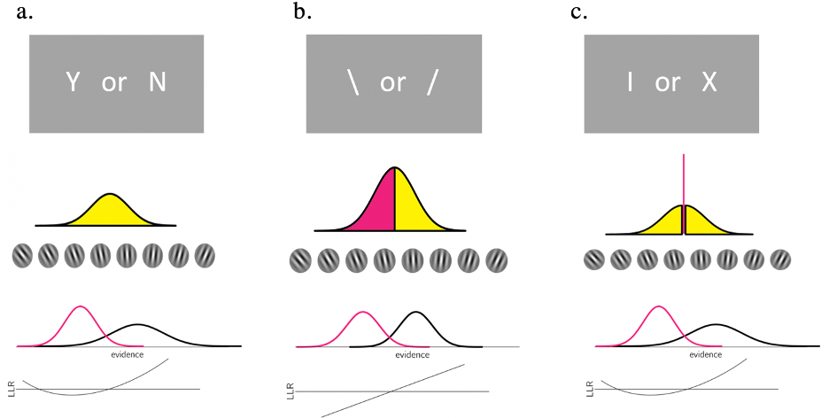

\clearpage\mbox{}\thispagestyle{empty}\clearpage

\setcounter{page}{1}

\thispagestyle{empty}
\begin{center}
\vspace*{10mm}
\textbf{\LARGE Metacognition in Distinct Perceptual Tasks}\\
\par
\begin{figure}[h]
\begin{center}
\includegraphics[width=!,totalheight=!,scale=0.8]{UCL.png}
\end{center}
\end{figure}
{\setstretch{1.7} 
\par
\par
{\large Institue of Cognitive Neuroscience}\\

{\large MRes Cognitive Neuroscience}\\
\bigskip
\par
\par
\par
\textbf{Primary Supervisor: Matan Mazor}\\
\textbf{Secondary Supervisor: Dr. Steve Fleming}\\
\par
\textbf{Chudi Gong}\\
\smallskip
September 2020\\
}
\end{center}

\newpage
\begin{center}
\textbf{\LARGE Acknowledgment}
\end{center}
\par
I would like to express my sincere gratitude to my supervisor, Matan, who guided me throughout the project and offered me with invaluable advise at every stage of the project. He has been not only an expert on providing professional suggestions, but also a patient mentor on answering questions. The way he motivated me to always explore further and challenge myself will continue benefiting my personal growth throughout my career, which I cannot thank him enough for. He has truly been a magnificent supervisor during this wonderful time. 

I also want to thank Dr. Steve Fleming for opening up the fascinating world of metacognition to me during my time at UCL, without which I would not be part of this amazing project and superb lab. His professional advice during the past year helped me greatly for conducting the project and the write-up of this thesis, that I will always be grateful for. 

Lastly, I want to thank all participants in our experiment, who made this study possible. Your efforts will always be remembered and appreciated. 

\newpage
\begin{flushleft}
{\setstretch{1.0}
\tableofcontents
}
\end{flushleft}

```{r setup, include=FALSE}
knitr::opts_chunk$set(echo = FALSE)
library(ggplot2) # for plotting graphs
library(citr) # for citation/reference management
library(tinytex) # for LaTex file compiling 
library(dplyr) # data manipulation
library(magrittr) # readable code (for operators etc.)
library(readr) # for reading data files (csv etc.)
library(tidyr) # for tidying data
library(data.table) # for data manipulation 
library(afex) #for anova calculation
library(RColorBrewer) # provides color palletes for graph plotting 
library(papaja) # apa stype for reporting data
library(MOTE) # required package for use of 'papaja'
library(MESS) # statistical functions used in conjunstion with papaja
library(lmerTest) # for mixed effects model fit
library(broom.mixed) # to tidy model fit coefficients
library(pwr) #package for power calculation
library(magick)
library(cowplot)
getwd()
se <- function(x) sqrt(var(x)/length(x)) 
```
\newpage

# 1. Abstract
A detection task, which requires one to identify the presence/absence of the target, is different from a discrimination task, which requires one to choose the target based on certain features. Both neural and behavioural studies suggest differences in the processes supporting metacognition about detection and discrimination. However, it remains unclear whether these are results of quantitative differences in the distribution of sensory inputs in detection and discrimination, or due to distinctive cognitive processes involved in these two tasks. This project tested a quantitative account (incorporating Signal Detection Theory) and a qualitative account (incorporating counterfactual reasoning) by using a new discrimination task that entails unequally distributed sensory inputs for two choices, to resemble a detection task quantitatively. With an incomplete sample (interrupted due to COVID-19), we confirmed the discrepancy in metacognitive sensitivity between two responses in detection in contrast to discrimination and furthermore, an even wider discrepancy was observed in the new tilt recognition task. However, the unique quadratic effect of confidence in detection observed in previous work was not replicated in our sample and we found no evidence to support task-related confidence effects in participants’ neuroimaging data, which could be due to underpowered sample or the previous finding being noise. We thus do not make conclusions from our results until data for a complete sample is collected.

\newpage
# 2. Introduction 
Understanding mechanisms supporting our daily cognitive functioning has been the central aim of scientific research across disciplines for centuries. In recent decades, beyond studying cognitive performances, another line of research concerns how we monitor, interpret, evaluate and reflect on those performances: the study of metacognition. Although metacognition deals with a subjective collection of judgments, feelings and predictions etc., it can have significant impacts on objective performances/behaviours. For example, when a student is setting a revision plan, the time allocated to each subject supposedly would depends on how this person judges the extent to which they have mastered that subject. Given its importance, the mechanisms supporting metacognition have been investigated extensively in both animals and humans, leading to developments of behavioural, neural and computational models.

The research of metacognition often rests on asking subjects to provide ratings of their subjective ‘confidence’, which can be defined as ‘a belief about the validity of our own thought, knowledge or performance that relies on a subjective feeling.’ [@grimaldi2015nbr]. Research investigating how confidence is formed with regards to perception commonly used discrimination tasks (sometimes labeled as categorisation), which involves distinguishing a target stimulus from other distractors based on certain features (e.g. whether the line is tilted to the left or the right). However, of equal importance, another type of perceptual task also makes up the very basics of our perceptual abilities ---- detection tasks. In detection tasks, participants identify the presence of a stimulus (e.g. whether a dot is present or absent). Evidence has suggested detection and discrimination can lead to differences in objective performance [e.g. @mack2010jephpp], different levels of metacognitive accuracy [@meuwese2014app] and neuroimaging data suggested different neural representations associated with judging confidence in these two tasks [@mazor2020e]. Various models have been put forward to explain the differences in metacognitive judgments in detection and discrimination, which can be divided into into two camps: 

* **Higher order interpretation**:  Detection and discrimination recruit different higher-order cognitive processes, such as self-monitoring and control of one’s internal state. This manifests as differences in confidence judgments for the two tasks. 

* **First order interpretation**: Behavioural and neural activities differ during confidence formation process as a response to the physical features of detection and discrimination at the perceptual level such as amount of sensory evidence. 

In the former interpretation, confidence judgments are a product of a distinctive cognitive process, divorced from the basic processing of sensory stimuli. Conversely, in the second interpretation such a division between first- and higher-order cognitive modules is not necessary, and confidence judgments arise from the same inferential process as perceptual processing.

The following section will start with describing the distinctive features of detection and discrimination and behavioural evidence showing different objective performances in them. Studies comparing the metacognitive performance for these two tasks will then be discussed, followed by the introduction of some models that have been put forward to explain differences in these two perceptual tasks, including both higher order interpretations and first order interpretations. These two different levels of explanations also motivate this project; we aim to compare the first-level account based on Signal Detection Theory (SDT) and higher-order account based on counterfactual reasoning for the distinctive patterns found in forming confidence in detection and discrimination. By adopting a discrimination task with the sensory features of a detection task, the design of this study allows us to untangle the qualitative and quantitative differences in detection and discrimination which will be introduced in the end of this section. 

## 2.1. Detection vs. Discrimination  
### 2.1.1. Differences between detection and discrimination

How do we detect and/or discriminate something? Does one first detect something is there (e.g. ‘I saw something is there’) and then further categorise it as a certain type (e.g. ‘The thing I saw is a car.’), or do we know what it is immediately when we see something is there (e.g. ‘I saw a car there)? This is an important consideration for a wide range of research themes, as it implies that perceptual processes might function in a task-specific manner that can potentially impact other subsequent decisions or judgments. 

Is detection simply a specific case of discrimination between signal and noise? Is discrimination the same as the detection of distinguishing target features? @mack2010jephpp  used a paradigm to assess the level of dependence of detection and discrimination at the basic-level (car vs. boats) and superordinate level (e.g. car vs. people). They found that detection and basic-level object categorisation is supported by a single mechanism as their results revealed a dependence between the success for the detection task and the success for basic-level categorisation task. However, the success for one to correctly categorise a target at superordinate level was not dependent on the success at detection, which suggests distinctive mechanisms supporting detection and superordinate categorisation. Their findings reflect the importance of distinguishing between different levels of discrimination (i.e. basic, ordinate and superordinate), challenging the view of a singular underlying perceptual ability for, or at least strong dependence between detection and discrimination suggested previously by @grill-spector2005ps. @grill-spector2005ps concluded that “as soon as you know something is there, you know what it is.”, based on the finding that participants’ response time and accuracy was similar between object categorisation and object identification, a deduction that now seems to be challenged by more recent findings such as Mack and colleagues’ work (2010). 

Another study comparing detection and discrimination found that the time taken to make a response in detection was significantly different in two choices whereas it was similar in discrimination (Mazor, Friston & Fleming, 2020). Participants were faster in giving 'Yes' responses than 'No' responses in a detection task whereas judging whether the line was tilted clockwise or anticlockwise took similar time in a discrimination task. The shorter reaction time in 'Yes' response was consistent with the long-established pattern that people are generally faster in giving positive responses than negative responses, despite these choices being true or false [@wason1959qjep]. The differences in reaction time between two responses suggest that detection and discrimination are two distinctive tasks that would lead participants to behave differently, which again highlights the importance of differentiating the two tasks for future research. 

### 2.2.2. Absence in detection

Another important difference between detection and discrimination tasks is that in discrimination tasks, sensory evidence is available for both alternative choices whereas in detection, virtually no sensory evidence is available for participants to make an absence decision. This makes the 'absence' condition in detection tasks a particularly interesting case: how do we detect nothing, based on nothing? The concept of nothing has sparked strong interests from philosophers and scientists for centuries, who have discussed this from different perspectives. Neuroscientists are interested in how our brain encodes something that is not there and translate it into sensory experience which is later used for decisions. The absence of a stimulus is traditionally thought to be coded by the brain as baseline activity in contrast to more robust firing of neurons in the presence of a stimulus. Contrariwise, when a continuous range of stimulus strengths are used, only those evoking activities beyond the threshold were considered to be perceived as present [@victordelafuente2005nn]. However, despite the lack of sensory evidence in absence conditions, recent evidence has suggested that neurons encode both stimulus absence and presence information [e.g. @merten2012p].

The study by Merten and Nieder (2012) was designed to investigate the neural representations of absence in rhesus monkeys dissociated from motor actions. Given previous finding that when no report was required, neurons encode information for both alternatives in a discrimination task [@bennur2011jn], it is possible that the both alternatives for detection, presence and absence, could also be encoded by neurons in a report-independent framework. They suggested that the lack of evidence supporting specific neural activation for the representation of absence is a result of the asymmetric response requirements in typical tasks, where responses are given for detecting a stimulus, but not for detecting stimulus absence. The active signaling of stimulus absence was thus not investigated. Using single neuron recordings, they found that in the prefrontal cortex (PFC), not only are there cells selectively encoding abstract 'Yes' decisions, but there also exists a group of neurons that fired at an increased rate to 'No' decisions. From their findings, it was shown that neurons in the PFC, known to be involved in high level cognitive functioning, are recruited in rhesus monkeys during stimulus-present trials as well as absence trials despite the fact that no sensory evidence is available in absence trials. 

A similar line of research has investigated the representation of ‘empty set’, the precursor for zero, in the brain. As trivial as this concept might appear, it actually makes up a fundamental part of the mathematical continuum that has not been investigated until recent decades [@rinaldi2016tics]. How does the brain react to an empty set, i.e. nothing in contrast to other numbers? It has been shown that a group of neurons in the posterior parietal cortex of monkeys were activated in response to numerosity ‘zero’ in a numerical operation task [@okuyama2015sr]. Furthermore, Okuyama and colleagues (2015) found two types of ‘zero’ neurons in the ventral intraparietal (VIP) area, that was shown to process inputs from visual, somatosensory and motor areas [@grefkes2005ja] and known for its involvement in visual perception of motion [@field2020na]. In the VIP area, they found an exclusive group that showed selective response to zero target in contrast to non-zero targets and a continuous group that encodes both zero and non-zero numerosities (from zero to four) with strength on a continuous spectrum. Their results showed the presence of active encoding of numerosity zero, i.e. empty set, both when treating it as a continuous and categorical variable. Similar results were found by [@ramirez-cardenas2016cb]. By training monkeys to perform a number matching task, they found that not only did all recorded neurons in VIP area and PFC respond to empty sets, some of them also discharged maximally to empty sets in comparison to other numerosities, i.e. were zero selective, which constitutes an even higher proportion of VIP cells in comparison to findings from @okuyama2015sr.

Together, this evidence suggests that the lack of sensory inputs in “absence” or “zero” does not necessarily imply inactivity of neurons in the brain. These findings challenge the belief that neural activity is proportional to the strength of sensory inputs, while it remains unclear where those representations of ‘nothing’ arises from and what consequences they lead to. One way to interpret the neural activities in response to ‘empty set’, for instance, is that they held explicit information of ‘nothing’ as working memory which is later used for the task as suggested by Okuyama, Kuki, and Mushiake (2015). Others have proposed that the lack of sensory signals leads brain to generate a quantitative representation of zero abstractly that is later positioned on a numerical continuum (Ramirez-Cardenas et al., 2016). Nonetheless, the uniqueness and level of cognitive demands required for representing nothing is unequivocal, which again potentially distinguishes detection tasks from discrimination tasks. This raises the interesting question of how subjective judgments are formed in detection, and in decisions about stimulus absence more specifically.

## 2.2. Forming confidence in detection and discrimination 

The first-order differences between detection and discrimination performance spark interests in studying the differences in second-order subjective experiences in these two perceptual tasks such as confidence. In psychophysics, the level of confidence observers assign to their decisions is studied in relation to objective performance. Participants are asked to give high confidence ratings when they believed their choice was correct and low confidence ratings if they are less certain. To maximally incentivise this manner of behaviour, participants are often offered bonus as reward for accurate judgments of confidence in relation to their objective performance. The correspondence between objective performance and subjective report reflects one’s ability to have insight into the objective correctness of their response, which is also known as one’s metacognitive sensitivity/accuracy. Metacognitive sensitivity is sometimes quantified as the area under the pseudo type-2 receiver operating characteristics curve (Type-II ROC), which is computed by combining confidence ratings with objective performances data [@fleming2014fhna]. A higher area under the curve (AUC) in Type-II ROC curves imply a higher level of metacognitive sensitivity. Research has shown that individuals’ metacognitive sensitivity can vary, depending on the domain of interests (e.g. memory vs. perception) and type of task (e.g. detection vs. discrimination). The following paragraphs in this section will present some studies showing distinct metacognitive performance found in detection and discrimination. 

@meuwese2014app found that metacognitive ability is higher in categorisation/ discrimination task than in the detection task for both masked and degraded stimuli. All participants performed the detection and discrimination task, which require them to identify the presence of an animal (e.g. Was there an animal present?) or identify the category (e.g. Was the animal a cat?). The stimuli were either masked by textured patterns or degraded by means of phase scrambling. Participants were then asked to rate how confident they were in the correctness of the choice they made on a scale of 1 to 6. The objective performance in detection and discrimination were also matched at the level of 71% correct to control for the potential confound of objective performance on confidence judgments. Three measures were included for metacognition: 1.) the classic AUC measure, which reflects the consistency between subjective confidence ratings of responses made and the actual, objective performance; 2.) Subjective Discriminability of Invisibility (SDI), which includes only trials of miss and correct rejections, i.e. trials in which participants reported a stimulus was absent developed by @kanai2010cc; 3.) Subjective Discriminability of Visibility (SDV) which includes only trials of hits and false alarms (i.e. trials in which participants reported a stimulus was present, see figure below). A classic Type II performance is calculated by substituting correct trials with high confidence as ‘‘hits” and incorrect trials with high confidence as ‘‘false alarms” at a second-level, respectively (Figure.1, left table). In the calculation of SDI, instead of aggregating hit (or miss) and correct rejection (or false alarm) trials as correct (or incorrect) trials, the second-level contingency matrix is constructed only for trials on which observers reported the absence of a target, i.e., correct rejections and misses (Figure.1, right table).

![Classic Type 2 measure and SDI, taken from @kanai2010cc. In type-II SDT, confidence ratings are treated as judgments about the accuracy of the response. High confidence in correct responses is thus treated as a 'hit', and high confidence in incorrect responses as a 'false alarm'. Similarly, low confidence in correct responses is treated as a 'miss', and low confidence in incorrect responses as 'correct rejection'. The SDI measure applies this scheme to trials in which the subject reported stimulus absence (type-I correct rejections and misses). ](Kanai_Walsh_SDI.png) 

They found that metacognitive sensitivity, according to the classic measure, is higher for discrimination than detection task (Figure.2). Participants can more accurately evaluate the correctness of their choice when the judgement is about which category the target belongs to than when the it is about whether a target was present. To further unpack the elements driving the differences between detection and discrimination, the metacognitive sensitivity for hits, misses, correct rejections, and false alarms were calculated separately. They found that lower metacognitive accuracy in detection compared with discrimination was driven by lower metacognitive accuracy for correct rejections. In other words, participants seemed to not have good knowledge of their correct absence decisions in detection tasks. Their results revealed several interesting aspects of confidence formation in these two tasks; people tend to have worse insight for detection than discrimination task, but only in situations where they have correctly rejected the target.


Consistent with findings in Meuwese et al. (2014), @zylberberg2012fin found that observers were only influenced by sensory evidence in favour of their decision when forming confidence judgments, while the sensory evidence for the unselected choice did not impact such judgments. This positive evidence bias was observed in two discrimination tasks, luminance comparison and random dot motion task. This bias may provide an explanation for the poor metacognitive performance in detection ‘No’ responses. Consider the situation where participants have made a correct “absence” decision: their confidence rating would in theory be strongly influenced by evidence in favour of this choice according to the findings from Zylberberg (2012). Hitherto, the lack of positive sensory evidence in these ‘absence’ trials might underlie a disturbance to a conventional confidence formation process that is engaged in present trials or discrimination trials. Although it is unclear what the consequences of such disturbance are (e.g. whether this gives rises to the employment of alternative processes such as counterfactual reasoning as discussed in section 2.4 below), the uniqueness of confidence formation in absent trials in detection is clear. Therefore, given the finding that participants were strongly influenced by the evidence for selected choice, the fact that in detection, virtually no sensory evidence is available in absence trials to support confidence judgments, and this may be a disadvantage for metacognitive judgments. However, research has also shown that not all types of subjective judgments towards absence decisions are disadvantaged and by manipulating the source of uncertainty in the task, one’s metacognitive performance can vary significantly [@kanai2010cc].

The study by Kanai and colleagues (2010) demonstrated that failure of visual perception is not always reflected by one’s subjective reports. They used a detection task in which participants were asked to report the presence of the target stimuli. Stimulus visibility was manipulated in six different ways, which were categorised in two groups: attentional manipulations (dual task, attentional blink and spatial uncertainty) and sensory manipulations (low contrast, backward masking and flash suppression). Participants reported their confidence ratings of the correctness of their response after each trial. Beyond using the traditional Type II AUC measurements as shown in Figure.1, they also developed a new measure termed Subjective Discriminability of Invisibility (SDI) based on computing the Type II performance but only for correct rejections and misses, i.e. trials in which participants report absence of the stimulus correctly or incorrectly, respectively (Figure.1). 

They found that SDI is significantly higher when stimulus visibility was degraded using attentional manipulations compared to sensory manipulations (Figure.3). In other words, participants can accurately judge whether their choice is a correct rejection or a miss when the difficulty arise as a result of increasing attentional demand, more than when the difficulty arise as a result of lacking sensory input. Therefore, the source of noise in perceptual tasks is an important consideration for observers making confidence judgments; confidence is often adjusted accordingly when noise arises from one’s internal cognitive capacity such as lack of attention whereas the impact of the physical property/environment of perceptual stimuli may not be picked up by observers during metacognitive judgments.

![ROC analysis of SDI for each condition. Greater SDI impies more accurate subjective confidence ratings, i.e. better Type II performance. SDI was above chance level in three attentional manipulations (D-F), reflected by the ROC curve situating above diagnal line. SDI was around chance level in three sensory manipulations (A-C). This graph shows that metacognitive sensitivity in absence responses was impaired in sensory manipulations more than in attentional manipulations. Taken from Kanai and Walsh (2010).](Kanai_Walsh_SDI_performance.png)

Taken together, these studies have shown that making subjective confidence judgments for decisions about which category the target belongs to is simpler than making subjective confidence judgments for decisions about whether something was present or not (Meuwese et al., 2014). Furthermore, the poor metacognitive performances in detection tasks seemed to be driven by the absence conditions, in which participants do not have access to sensory evidence to the selected choice that could potentially impair their metacognitive judgement according to positive evidence theory (Zylberberg et al., 2012). However, the impairment of metacognition in absence trials was also found to be dependent on the source of noise, such that observers can recognise cognitive difficulties (e.g. attentional blink) and make confidence ratings accordingly while they did not take into account of sensory difficulties for confidence ratings. 

## 2.3. Neural underpinnings of confidence

What brain regions support the formation of metacognitive judgments? Developments in neuroimaging method allow us to reveal the neural underpinnings of confidence formation in both animals and human. Studies have shown rostrolateral and dorsolateral prefrontal cortices are key brain areas involved in confidence judgments in human [@fleming2012jnojsn; see @fleming2012ptrslbbs for a review]. However, as metacognitive judgments often co-occur with decision-making, some researchers suggest that confidence judgments share a neural system employed by decision making, while others presented evidence in favour of an independent neural network specific for metacognitive judgments (Qiu et al., 2018). Qiu and colleagues thus conducted a study to locate the neural systems supporting metacognition independent of decision-making, in which they identified an independent network in the PFC supporting metacognition.

Given the behavioural studies described in previous section, showing different metacognitive performance in discrimination and detection, it is reasonable to expect distinctive neural representations supporting these judgments. Mazor, Friston, and Fleming (2020) thus investigated the neural contributions to confidence judgments in detection and discrimination tasks. Participants were asked to judge whether a grating was present (detection) or to discriminate between two grating orientations (discrimination), after which they reported their confidence ratings. Their results revealed distinct neural representations of confidence in detection and discrimination in several areas. Specifically, a more pronounced quadratic effect of confidence was observed in the frontopolar cortex (FPC) in the detection task compared with the discrimination task, which provides neural data to demonstrate that making subjective judgments differs between detection and discrimination. As discussed before, this is likely to be due to a unique subjective evaluation process related to absence trials, which was supported by the finding that quadratic confidence effects were stronger for absence decisions than presence decisions in the right temporoparietal junction (rTPJ). The rTPJ was known to be involved in various pivotal cognitive functions such as attentional control (Marois et al., 2004), awareness of actions [@blakemore2002tcsa] and social cognition [@decety2007nbma]. Mazor and colleagues proposed two different approaches to explain this pattern of activation in rTPJ, which will be discussed in section 2.4.

Previous research in metamemory also contributes to the discussion of making confidence judgments about absence. @miyamoto2018n found that Brodmann area 10, which is known to be involved in a series of high-order executive functions, is also recruited for metacognitive evaluation of non-experienced events in macaque monkeys. The frontopolar cortex plays a causal role to confer subjective experiences of non-experienced events according to their results. This was concluded by showing that not only were neurons in frontopolar cortex active during the metacognitive judgments of non-experienced events, but also inactivation in this area impaired the monkeys' ability to make such subjective judgments while the objective performance was intact. Their finding reflects the possibility that the frontopolar cortex is involved in making confidence judgments of absence since absence can be regarded as ‘non-experience of the stimulus’, which would reflect a qualitative distinctiveness of absence and hence detection from discrimination. 

## 2.4. Models of confidence formation

After reviewing the literatures on detection and discrimination, this section will discuss some computational models that explain confidence formation generally, namely signal detection theory (SDT) and Bayesian models. We then introduce the two explanations we propose to account for differences in metacognition between detection and discrimination based on the first- and higher-level of interpretations. 

### 2.4.1.Confidence in SDT

The most common application of SDT is to provide a measure for calculating the ability of a classifier/observer to distinguish signal from noise [@wickens2002]. In a basic representation of a binary perceptual task within SDT, shown in figure 4 below, the two distributions correspond to the probability/likelihoods of the detected stimuli being signal or noise given certain amount of evidence on the x-axis. These distributions are conceptually produced by repeating the experiment many times and recording the outcomes which allows one to compute the likelihoods of each outcome. It is worth noting here that in such simplified model, the distributions for two alternative choices are considered of equal variances where it is possible for them to be unequal, which will be discussed later in section 2.4.4. 


\par
In the context of psychophysics, SDT provides estimates for two important parameters: perceptual sensitivity (the capacity to tell signal from noise), and bias (the tendency to give one response over the other). Perceptual sensitivity is defined as the differences between the means of the noise and signal distributions ($d’$ in Figure 4). The bias, also known as response criteria (λ), is the boundary for which the observer decides to give the two responses. For example, in Figure 4, given evidence _x_ exceeds the value of λ, the observer will give 'Yes' response and for evidence below the value of λ, they would give 'No' response. SDT model allows convenient mathematical transformations to derive sensitivity and criterion directly from behavioural data (Wickens 2002). In a simple psychophysics experiment, there are four possible outcomes of participants responses which is shown in Figure 5 below. Provided with the $H$ and $FA$ rate, perceptual sensitivity ($d’$) can be calculated as $z(H) − z(FA)$ and λ can be calculated as –$\frac{(z(H)+z(FA))}{2}$.


\par
SDT not only explains how observers distinguishes signal from noise, it can also be adapted to account for the confidence rating process (Wickens, 2002). In a confidence rating experiment, participants are required to not only give signal presence or absence responses, but also how confident they were towards such decision. Within this adapted version of SDT, different confidence levels are separated by multiple criteria (see Figure.6), in contrast to one criterion in the elementary framework. For evidence falling within each criterion intervals, participants would give that response at that confidence level, e.g. given evidence of value between $λ_3$ and $λ_4$, participants would give a Y1 response, which could correspond to an 'uncertain Yes' in a detection task.


Based on SDT and Bayesian inference, a first-order model was put forward previously to explain the process of forming subjective reports [@king2014ptrslbbs]. In this model, subjective judgments were based on the same inferential process as objective perceptual decisions; both influenced by the strength of the sensory stimuli and prior beliefs. According to this model, the content of subjective report such as confidence is the outcome of an inferential decision process, influenced by the stimulus inputs, with a rich set of different output classes that have incorporated prior beliefs, rather than a simple present or absent decision (see Figure.7 below). In addition, this model shows that the formation of second-order confidence judgments which reflects the probability of a choice being correct, is unique in each task (Figure.7). In such first-order models, confidence judgments are made through the same level of cognitive process as first order judgments without involving other higher cognitive process. 


\newpage 
### 2.4.2. Bayesian models of confidence formation
Apart from SDT type of account for confidence formation, another widely accepted view is that human confidence report reflects a Bayesian probabilistic estimation of a choice being correct. That is the judgments of confidence are made based on the posterior probability of the decision made being correct formed by the observer. 

To test this assumption, @adler2018pcb compared the Bayesian and non-Bayesian alternative models for forming confidence using two categorisation tasks. The tasks essentially require the participants to report the direction of the stimulus shown which could be a visual grating or ellipse, as well as the level of confidence in their choices simultaneously in one press (see Figure 8). The contrast of the grating and elongation of the ellipse were manipulated to give rise to the measure of stimuli reliability and corresponds to the level of sensory uncertainty. 


They found subjects did take into account the level of sensory uncertainty, the prerequisite of Bayesian reasoning for confidence judgments without forming a posterior. Confidence judgments, according to their analysis, are affected by global beliefs about sensory uncertainty in perception, but in a simpler heuristic way, i.e. probabilistic non-Bayesian [@ma2012tics], rather than fully Bayesian. 

Uncertainty in perceptual tasks does not only arise from the features of sensory inputs, such as the contrast of a grating, it can also results from competing cognitive demands such as attention. @denison2018pnasusa used a task in which observers' attention was manipulating by changing the correspondence between the positions of the cue and the response, where in a valid (attended) condition, the observer was first cued to the position that they need to make decision about later. By fitting Bayesian and fixed models to participants' performance, they found that observers took into account of uncertainty related to attention for both first-order perceptual decisions and second-order confidence reports in an approximately Bayesian style. Bayesian models are thus distinctive from SDT models where confidence judgments remain unaffected by the beliefs of uncertainty and based solely on sensory inputs. 

Models described so far explain the general confidence formation process. However, they do not account for the differences between detection and discrimination discussed in previous sections. In the next two sections, a qualitative account (counterfactual reasoning model) and a quantitative account (unequal variance model) will be introduced to explain some of the previous findings.  

### 2.4.3. Counterfactual reasoning models

It has been argued that detection and discrimination are qualitatively different thus leading to distinct metacognitive processes. Specifically, the unique absence condition in detection might motivate participants to adopt alternative mechanisms for metacognitive judgments that are qualitatively different from mechanisms used in conventional discrimination. One proposal is that due to the lack of sensory input for absence trials, participants might instead refer to their perceived likelihood of having detected a hypothetical target, i.e. the counterfactual situation, in order to make confidence rating for absence trials. Recall the study by Zylberberg et al. (2012), in which they found that metacognitive judgments are influenced by evidence in favor of the selected choice, this positive evidence effect and lack of evidence in absence together is thus likely to encourage participants to employ a counterfactual reasoning process. Such counterfactual reasoning process is expected to be influenced by their current state of attention: participants are likely to give low confidence ratings when they evaluate themselves as less attentive as their judgments about the possibility of the counterfactual situation is less certain and vice versa. 

Behavioural results have supported a role of attention monitoring in subjective judgments of performance [@kanai2010cc]. People seem to be able to distinguish their correct rejections from misses when the task difficulty arises from competing attention resources in contrast to when it arises from lack of sensory input. In discrimination tasks, it was also found that uncertainty associated with attention influences observers’ categorisation performance and confidence rating in a Bayesian style [@denison2018pnasusa]. Neuroimaging data also suggested a role of attention in judging subjective experiences in a perceptual filling-in task where participants' confidence rating was negatively correlated with attention [@davidson2020b]. Therefore, the process of a counterfactual reasoning, under the influence of monitoring internal states, is possible in the absence trials for detection.

According to this account, the differences in frontopolar activations in detection and discrimination might reflect a role of this area in referring to an internal hypothetical state. This hypothesis shares a ground with previous finding that changes in the connectivity of the frontopolar cortex tracks the switching to an alternative choice [@boorman2009n] as such switching requires one to first hold a hypothetical representation of the alternative choice. Similarly, the more pronounced quadratic effect of confidence found in rTPJ for absence might also be a representation of counterfactual reasoning process in those trials or an interactive modulation of attention occurring in counterfactual reasoning. 

However, it is important to note here that such counterfactual model incorporating attentional control could only account for distinct activations in ‘No’ responses whereas @mazor2020e found similar quadratic pattern in ‘Yes’ trials as well. Further investigations are therefore needed to confirm the role of counterfactual reasoning in detection and discrimination.

### 2.4.4. Unequal variance model
SDT does not only provide an account of the general confidence formation process, it can also explain differences in confidence formation found in detection and discrimination in an unequal variance model. In a typical discrimination task, the sensory evidence for two alternatives are equally distributed (Figure.9, a). In contrast, in a detection task, the sensory evidence for two competing choices is considered to be unequally distributed, with a greater variance in the presence trials than the absence trials (Figure.9, b). In signal presence trials, evidence variability is assumed to be the sum of internal variability in neural firing and external variability in the stimulus itself. In signal absence trials, evidence variability comprises internal variability only, resulting in a less variable distribution over trials. This asymmetry in distributions has significant impact on how an observer makes a decision between two competing hypotheses based on likelihood-ratio testing.  

In binary tasks, observers face two opposing hypotheses (h1 and h2): in detection h1 is that the stimulus shown was a signal and h2 being that the stimulus was a noise; in discrimination h1 is that the stimulus was from group 1 and h2 being the stimulus belonged to group 2. The likelihood-ratio testing method allows observers to choose between two hypotheses based on the principle that when one hypothesis is more likely than the other, the observer would commit to choosing this hypothesis. According to the likelihood-ratio calculation of decision making for a binary task, $log\frac{(l(h1))}{(l(h2))}$ , equal variance implies a linear function of log likelihood-ratio with respect to sensory evidence, whereas unequal variance implies a quadratic function (Wickens 2002). As mentioned before, detection has unequally distributed sensory evidence for two choices and discrimination has choices with equally distributed sensory evidence (see Figure.8).

Therefore, in relation to the findings from Mazor et al. (2020), a more pronounced quadratic effect of confidence in FPC in the detection task might arise as a result of activation in this area representing the log likelihood ratio of committing to ‘Yes’ or ‘No’ responses drawing from unequally distributed evidence. In contrast, the confidence effect would be linear when neurons were representing the relative likelihood of ‘Left’ or ‘Right’ drawing from equally distributed evidence. Such unequal variance model attributes the differences in confidence judgments between perceptual tasks to the sensory properties of alternative choices, which reflects a quantitative aspect of consideration. 

```{r fig.env = "sidewaysfigure", fig.cap = "Representation of perceptual tasks from the unequal variance SDT models (a., b. and c. correspond to detection, discrimination and tilt recognition tasks respectively). The upper panel shows two alternative choices in each task. Middle panel represents the possible stimuli in each task and the distributions of sensory evidence. Note here that in detection no sensory evidence is available for absence ('No') conditions thus only distribution for presence ('Yes') condition is shown. The bottom panel demonstrates the transformation into log likelihood ratio (LLR) based on SDT for each task, where equal variance distributions for two alternative choices implies a linear function of LLR (b) and unequal variance distributions implied a quadratic function(a, c).", out.width="120%", out.extra = ""}

```

It is important to emphasise here that this model differs profoundly from the counterfactual reasoning model such that the former considers that metacognitive judgments were produced through basic level sensory processing whereas the later treats it as a distinct cognitive process that requires higher-order capacities.


\newpage
## 2.5. The current study 

To untangle the first-order and higher-order models described above, the current study includes another discrimination task with unequal evidence distributions (Figure.9, c) in addition to a detection and a discrimination task that are typically used in psychophysics. This will allow us to separate the quantitative feature of the task, i.e. type of distribution, from the qualitative ones, i.e. type of task. We built on the design of @mazor2020e including three perceptual tasks while participants’ brain activations are being monitored in an MR scanner: a). discrimination task with equal variance (whether the grating were tilted to the right or left; b). detection task with unequal variance (whether a grating was present or not); c). discrimination task with unequal variance (whether the grating was vertical or tilted towards any direction) which we refer to tilt recognition task in this project. Participants are asked to rate their confidence about their decision following each decision.  

In line with the unequal variance model, a discrimination task with the attributes of unequally distributed evidence for two alternatives would also lead to similar performance to a detection task. Therefore, if participants exhibit similar patterns of behaviour in the new tilt recognition task as that in detection, it would provide support to the first order accounts such as the unequal variance model. Specifically, the performance in the 'Tilted' condition in the new tilt recognition task would be similar to that in the 'Yes' condition in detection as these two choices entail greater variances for sensory evidence based on unequal variance model. On the other hand, if performance in the tilt recognition task more resembles that in discrimination, the higher order interpretations are more plausible. For neural data, if quadratic effects of confidence on brain activations are observed in both the discrimination task with unequal variance and the detection task, it is likely that neurons in this area represent the relative likelihood of two competing choices in perceptual tasks as predicted by the SDT model. On the other hand, if the discrimination task with unequal variance shares a similar linear activation profile with the equal-variance discrimination task, it would suggest that the difference in neural representations of detection and discrimination is driven by some qualitative features of detection, such as counterfactual reasoning proposed in current study.

An important alternation we make to the task used in previous study by Mazor, Friston and Fleming (2020) is that instead of having the target and noise emerges from a blank background, in the current study, dynamic noise was used as background and signals emerged from noise instead. The appearance of noise from a blank background could be argued as a form of presence, and thus this type of detection could be considered as a pseudo detection, which resembles a discrimination task, i.e. discriminating the appearance of the noise from the appearance of the target from a blank background. It was reported that this type of pseudo detection did not impair metacognitive sensitivity in absence trials as it would in true detection [@maniscalco2011jov]. Therefore, to ensure the use of a true detection task, the stimulus presentation method was changed in the current project. 

## 2.6. Aims and Hypothesis

The current study aims to study how human form confidence in detection and discrimination tasks both from behavioural and neural perspectives. Specifically, this project aims to:

* Compare the objective performance of the new tilt recognition task with detection and discrimination

*	Compare the metacognitive performance of the new tilt recognition task with detection and discrimination.

*	Replicate the finding from (Mazor, Friston, & Fleming, 2020) that an interaction between task (discrimination/detection) and the quadratic effect of confidence, in medial and lateral frontopolar cortex. 

Specifically, we make the following predictions based on unequal variance model:

According to this model, we expect 'Tilted' responses to behave like 'Yes' responses (as both correspond to the high-variance condition) and 'Vertical' responses to behave like 'No' responses (as both correspond to the low variance condition). We thus expect to see:

* Response time is faster for 'Tilted' than for 'Vertical' responses in the tilt recognition task. 

*	Participants are more confident in 'Tilted' than in 'Vertical' responses in tilt recognition task.

*	Higher metacognitive sensitivity for 'Tilted' response than for 'Vertical' response in the tilt recognition task. 

*	More pronounced quadratic expansion of confidence in the frontopolar cortex in tilt recognition than in discrimination.

# 3. Method 
## 3.1. Overview
The current study involved two parts: a behavioural training session lasting around 60 minutes and a scanning session lasting around 90 minutes with intervals no longer than two weeks. Both parts of the experiments took place at the Wellcome Centre for Human Neuroimaging, University College London. This project followed a preregistration ( [link](https://github.com/efkccc/Data-analysis/blob/master/pre-registration%20document.pdf "preregistration document")) and open science practices. All data and analysis scripts are available on Github (https://github.com/efkccc/Data-analysis) and this dissertation is fully reproducible via RMarkdown. Candidate was involved in the design of experiment and data collection with help from Matan Mazor. The analysis script, embedded in the Rmarkdown file for this dissertation, was written by the candidate, with advice from Matan Mazor and Steve Fleming (a full contribution history could be found on https://github.com/efkccc/Data-analysis ).

## 3.2. Participants
34 healthy participants were recruited, and according to the preregistration exclusion criteria (see Section 3.3.1 for details), data from 25 participants were included in the final analysis. Participants received cash payments as compensation for their time: £10 for the behavioural session and £20 for the scanning session. To motivate participants to perform their best in our tasks, we also offered bonus payment for good performance and accurate confidence ratings (see Section 3.3.2 below for details on bonus calculation).  
 
## 3.3. Experimental Procedure 
### 3.3.1. Behavioural session

During behavioural training session, participants first received introductions of the study, including general procedure, ethic and data protection protocols. The structure of the three tasks (see Figure.9 for the schematic representation) were explained to participants as following:

* Detection task: In half of the trials, a noisy grating will appear after the fixation cross and on the other half there would be no grating shown and you need to decide whether there was a grating present.

* Discrimination task: A grating will appear on the screen every few seconds after the fixation cross, which will be tilted clockwise in half of the trials and anticlockwise in other half. Participants were asked to decide which direction the grating was Tilted to. 

* Tilt recognition task: A grating will appear on the screen every few seconds after the fixation cross, which will be tilted (to any direction) in half of the trials and vertical in other half. Participants were asked to decide whether the grating was 'Tilted' or 'Vertical'. 

* Confidence rating: In all three tasks, immediately after making a choice, you need to indicate how confident you are in your decision by changing the size of the circle.

```{r fig.env = "sidewaysfigure", fig.cap = "Schematic representation of the task structure. Each block starts with a frame displaying the task information (i.e. detction, discrimination or tilt recognition, which is then followed by a balck dot at the centre of the screen as a rest period for 500-4000ms. Each trial starts with a fixation cross indicating the begining of the trial for 500ms. The stimulus is then presented for 500ms. The fixation point appears again for 100ms, indicating the beginning of the decision window. Participants have 1400ms to make a choice, which is then followed by a 2800ms window to rate their confidence.) ", out.extra = ""}
knitr::include_graphics("experimental_procedure.png")
```

This session contained a practice block, a calibration block and several training blocks for all three tasks. No feedback was provided to participants about their performance. The response mapping was counterbalanced between blocks. As a result, participants alternated between two different keys for each response between blocks. For example, in the detection task, half of the blocks requires participants to press key “8” to for 'Yes' response and in the other half they would need to press key “9” to give the 'Yes' response. This is to avoid potential associations between the key and the response that might bias subjects’ choices. Confidence ratings were achieved by changing the size of the circle and participants were divided into two groups such that for half group of participants bigger circle corresponds to higher confidence levels and for the other half bigger circle corresponds to lower confidence levels. Such design of counterbalancing is to avoid unrelated visual activation inside the scanner, confounding the effects of confidence of our interests. 

During this session, participants’ performance was controlled around 70 % accurate, by manipulating the task difficulty independently for the three tasks. This was achieved by using the common 1 up 2 down staircase procedure on stimulus visibility (discrimination and detection task) and on the standard deviation of the orientation distribution (tilt recognition). Participants were not invited back to continue the scanning session if:

* Their accuracy were lower than 60% or higher than 80%. 
* They had strong response bias, i.e. used the same response in more than 80% of the trials. 
* They had strong confidence bias, i.e. the same confidence level was reported for more than 90% of the trials.

### 3.3.2. Scanning session

The structure of the three tasks were the same as behavioural session. To motivate participants perform we offered bonus in addition to the baseline payment for the scanning session.  Bonus is calculated use following rule:		
bonus=$£\frac{\overrightarrow{accuracy}.\overrightarrow{confidence}}{200}$. Where $\overrightarrow{accuracy}$ is a vector of 1 and -1 for correct and incorrect responses, and $\overrightarrow{confidence}$ is a vector of integers in the range of 1 to 6, representing confidence reports for all trials. The rule for bonus calculation was explained to participants in both sessions. The scanning session started with a calibration phase to further calibrate participants performance during which time the structural scan for each participant was also obtained. At scanning, 10 discrimination and detection blocks were presented in 5 scanner runs. 

## 3.4. Stimulus

Each trial started with a fixation cross that was an indicator for participants as the beginning of tasks, which lasted for 500 milliseconds. We then presented the stimulus on the screen for 500 milliseconds, which consisted of 10 grayscale frames. Those frames were presented at 20 frames per second within a circle of diameter 3°. The details for generating stimuli are following (as stated in [preregistration](https://github.com/efkccc/Data-analysis/blob/master/pre-registration%20document.pdf "preregistration document")):

* Generate 10 grayscale frames ( _F_ ... _F_ ), each an array of 142 by 142 random luminance values.
* Create a 142 by 142 sinusudial grating ( 24 pixels per period, random phase). The orientation of the grating is determined according to the trial type.
* The grating visibility for frame _i_ is _pi_ = _v_ × _exp_(-$|\textit{i}-5|$/2) with _v_ being the visibility level in this trial (0 for target-absent trials).
* For each pixel in the frame $𝐹_𝑖$,$𝑗$,$𝑘$, replace the luminance value for this pixel with the luminance value of this pixel in the grating with a probability of $𝑝_𝑖$.

## 3.5. Scanning parameters 

Scanning took place at the Wellcome Centre for Human Neuroimaging, London. We first acquired the structural images using an MPRAGE sequence (1x1x1 _mm_ voxels, 176 slices, in plane FoV = 256x256 _mm_ 2). This was then followed by a double-echo FLASH (gradient echo) sequence with TE1=10ms and TE2=12.46ms (64 slices, slice thickness = 2 _mm_, gap = 1 _mm_, in plane FoV= 192×192 _mm_ 2, resolution = 3×3 _mm_ 2) which were later used for field inhomogeneity correction. Participants' functional scans were obtained using a 2D EPI sequence, optimized for regions near the orbitofrontal cortex (3.0x3.0x3.0 _mm_ voxels, TR=3.36 seconds, TE = 30 ms, 48 slices tilted by -30 degrees with respect to the T¿C axis, matrix size = 64x72, Z-shim=-1.4).

## 3.6. Regions of interests (ROIs)
Apart from whole brain exploratory analysis, imaging data were analysed with focuses on the following regions of interests as specified in pre-registration, which was largely based on findings from @mazor2020e: 

  * Frontopolar cortices, Medial frontopolar cortex (FPm) and Lateral frontopolar cortex (FPl): These clusters were defined by a connectivity-based parcellation [@neubert2014ncm] and the right hemisphere mask was used as mirror to create a bilateral mask.
  
  * Posterior medial frontal cortex (pMFC): The pMFC was defined as a 8-mm globule around MNI coordinates [0, 17, 46] [@fleming2012jnojsn] and aligned to the cortical midline 
  
  * Ventromedial prefrontal cortex (vmPFC): The vmPFC was defined as a 8-mm globule around MNI coordinates [0,46,-7] [@bartra_valuation_2013] and aligned to the cortical midline.
  
  * Right temporoparietal junction (rTPJ): The rTPJ was defined as the cluster from the quadratic confidence design matrix from @mazor2020e (peak voxel [54,-46, 26]).
  
  * Pre-supplementary moror area (preSMA): The rTPJ was defined as the cluster from the quadratic confidence design matrix from @mazor2020e (peak voxel [0,35,47]).

## 3.7. Imaging analysis
Imaging analysis was performed in MATLAB and SPM following the standard metalab imaging pipeline (https://github.com/metacoglab/MetaLabCore). Analysis for BOLD signals was performed on beta coefficients from a GLM design matrix where each trial was modeled with a separate regressor (event duration: 4300 ms, convolved with a standard hemodynamic response function). The design matrix also included nusance regressors for motion, physiological measures, and motor responses. A linear regression model was then fit to the single-trial $\beta$ coefficients of each participant, and the resulting coefficients were subjected to group level ordinary Least Squares testing. We also conducted a whole brain analysis (uncorredcted for multiple comarisons, due to the incomplete sample) based on the Quadratic-Confidence Design Matrix (QC-DM) specified in the [preregistration](https://github.com/efkccc/Data-analysis/blob/master/pre-registration%20document.pdf "preregistration document").

```{r tidy data, include=FALSE, cache=TRUE}
# open file
data <- read.csv("data.csv")

# creat a new file with only included trials+ transform rt into log_rt
data_valid <- data %>% 
  #Filter out the excluded trials 
  filter(inclusion==1) %>%
  filter(! response=="NaN") %>%
  mutate(rt=response_time*1000) %>%
  mutate(log_rt=log(rt))
data_valid

# save a version of the df with raw response&stimulus code (i.e. 1 and 0)
data_valid_raw <- data_valid

# change response codes
data_valid$response[(data_valid$response=="0") &
                                   data_valid$task=='Detection'] <- "No"

data_valid$response[(data_valid$response=="1") &
                                   data_valid$task=='Detection'] <- "Yes"

data_valid$response[(data_valid$response=="0") &
                                   data_valid$task=='Discrimination'] <-"AntiClockwise"

data_valid$response[(data_valid$response=="1") &
                                   data_valid$task=='Discrimination'] <- "Clockwise"

data_valid$response[(data_valid$response=="0") &
                                   data_valid$task=='Tilt'] <- "Vertical"

data_valid$response[(data_valid$response=="1") &
                                   data_valid$task=='Tilt'] <- "Tilted"

# transform into data.table
dt <- data.table(data_valid)
dt_raw <- data.table(data_valid_raw)

# create a tidy version of data file (BOLD signal as a single vector, ROIs as the grouping variable)
data_tidy <- rename(data_valid, c('rTPJ'='BOLD_rTPJ', 'vmPFC'='BOLD_vmPFC', 'FPl'='BOLD_FPl', 'FPm'='BOLD_FPm', 'pMFC'='BOLD_pMFC', 'preSMA'='BOLD_preSMA'))
data_tidy <- gather(data_tidy, "ROI", "BOLD", 16:21)%>% filter(!BOLD=="NaN")

# separate the data for each task respectively
data_det <- data_valid %>%filter(task=="Detection")
data_dis <- data_valid %>%filter(task=="Discrimination")
data_til<- data_valid %>%filter(task=="Tilt")

# get the total number of participants
no_subj <- length(unique(data_valid$subj_id))

# count the total No of trials for each task for each participant
total_trials <- data_valid %>% group_by(subj_id, task) %>% summarise(totaltrials=(count=n()))

#get the number of trials for each participants where the stimulus shown is 1 (i.e.Present, Clockwise & Tilted)
sti_trials <- data_valid %>% group_by(subj_id, task) %>%filter(stimulus=="1")%>%summarise(sti_trials=(count=n()))

#count No. of correct trials for each task for each participant
individual_trials <- data_valid %>% 
  #group by ID, type of task and accuracy
  group_by(subj_id, task, accuracy) %>% 
  #count number of correct/incorrect/NAH trials 
  summarize(no_trials=(count = n())) %>%
  #combine with the total data frame
  inner_join(total_trials, by = c ("subj_id","task")) %>%
  mutate(proportion = no_trials / totaltrials)

#display accuracy 
individual_accuracy <- individual_trials %>% filter(accuracy==1) %>%rename(correct=proportion)

# power calculation based on previous results from Mazor et al. (2020)
power <- pwr.t.test(d = 0.35,
           sig.level = 0.05,
           n=25,
           )

```

\newpage
# 4. Results
## 4.1. Behavioural results
```{r , performance analysis, include=FALSE, cache=TRUE}
#display accuracy for each task 
task_accuracy <- individual_accuracy %>% group_by(task) %>% summarise(mean(correct)) %>% spread(key='task', value='mean(correct)')

#ANOVA comparing task performance 
aov_accuracy <- aov_ez(data=individual_accuracy, dv= "correct", within= "task", id= "subj_id")

#################
#calculating d'
#################
#count the number of accurate/inaccurate trials for each response for each task & combine with the sti_trials data frame
trials <- data_valid %>% 
  #group by ID, type of task and accuracy
  group_by(subj_id, task, accuracy, response) %>% 
  #count number of correct/incorrect/NAH trials 
  summarize(no_trials=(count = n())) %>%
  inner_join(sti_trials, by = c ("subj_id","task"))

# transform trials into data table and include only positive responses for three tasks
dt_trials  <- data.table(trials)%>% filter(response=="Yes"| response=="Tilted"| response=="Clockwise")
# calculate the z value for hit and fa 
rate_subj <- dt_trials[, .(rate=no_trials/sti_trials), by=.(subj_id,response, accuracy)] %>% mutate(z_rate=qnorm(rate))  

# drop the rate column (for later 'spread' function to work properly)
rate_subj$rate <- NULL

# spread the file based on accuracy (i.e. HIT and FA respectively)
rate_subj <- spread(rate_subj,key='accuracy', value='z_rate')  
colnames(rate_subj) <- c("subj_id", "response", "z_FA", "z_HIT")

# d prime for each subjects and task
d_subj <- rate_subj[, .(d_prime=z_HIT-z_FA), by=.(subj_id,response)]

# d prime for each task
d_task <- d_subj[, .(mean_d=mean(d_prime)), by=.(response)] 

#ANOVA comparing d prime
aov.d <- aov_ez(data=d_subj,
                id="subj_id",
                dv= "d_prime",
                within = "response")
```

```{r, echo=FALSE, message=FALSE, fig.cap="\\label{fig:accuracy} Mean accuracy across three tasks", cache=TRUE}

number_ticks <- function(n) {function(limits) pretty(limits, n)}

ggplot(individual_accuracy, mapping = aes(x= task, y=correct)) + ylim(0.4, 1) +labs (y="mean accuracy")+ theme_classic() +
   geom_boxplot()+ geom_jitter(position=position_jitter(width=.1, height=0), alpha=0.3, size=4) + scale_y_continuous(breaks=number_ticks(6), limits=c(0.4, 1)) + geom_hline(yintercept=0.5, linetype="dashed", color = "black") + theme(plot.title = (element_text(color = "black", size = 12, face = "italic")))

```

### 4.1.1. Performance across threee tasks
The performance across three tasks, detection (accuracy= `r apa(task_accuracy$Detection, 2, T)`, d'= `r apa(d_task$mean_d[d_task$response=='Yes'], 2, T)`),  discrimination (accuracy= `r apa(task_accuracy$Discrimination, 2, T)`, d'= `r apa(d_task$mean_d[d_task$response=='Clockwise'], 2, T)`) and tilt recognition (accuracy = `r apa(task_accuracy$Tilt, 2, T)`, d'= `r apa(d_task$mean_d[d_task$response=='Tilted'], 2, T)`) was similar. Accuracy was computed as the proportion of correct trials out of total number of trials and d’ was calculated using the following formula:  d’ = z(FA) – z(H). A one-way ANOVA failed to detect a significant difference between the accuracy of these three tasks (`r apa_print(aov_accuracy)$full_result`) and d' (`r apa_print(aov.d)$full_result` ; see Figure \ref{fig:accuracy} ), which reflects a good control over the difficulty level and objective performance across the three tasks. 

``` {r Type 2 ROC , echo=FALSE, message=FALSE, }
#get the total number of trials for correct vs incocrrect for each response respectively 
acc <- data_valid %>%
  group_by(subj_id, task, accuracy, response) %>%
  summarise(acc_trials=(count=n())) 

#get the total number of trials for correct vs incoccrect for each response respectively at each confidence rating
conf <- data_valid %>%
  group_by(subj_id, task, accuracy, response, confidence) %>%
  summarise(conf_trials=(count=n())) %>%
  inner_join(acc, by = c ("subj_id","task", "response", "accuracy")) %>%
  # calculate the prob of giving each confidence rating in that response (correct vs. inccorect) for each subject
  mutate(prob=conf_trials/acc_trials) 

#calculate individual AUC
# filling in the missing values for each combination (task, accuracy, response and confidence, i.e.where ppl didn't give all conf ratings)
conf_subj <- conf %>% ungroup %>% complete(subj_id, accuracy, response, confidence = 1:6, fill = list(conf_trials = 0, prob = 0)) %>% group_by(subj_id, task, accuracy, response, confidence)

# convert into data table
conf_subj <- as.data.table(conf_subj)
# sort the df with descending confidence level
conf_subj <- conf_subj[order(-confidence),]

# get the cumulative prob for each task & response & accuracy for each subject 
cum_prob_subj <- conf_subj[, .(cum_prob=cumsum(prob), confidence), by=.(subj_id, response, accuracy)] %>% spread(key=accuracy, value=cum_prob)%>% rename("correct"="1", "incorrect"="0") %>%   #add the origin(0,0) point for each ROC plot
  complete(nesting(subj_id, response), confidence = 1:7, fill = list(correct=0, incorrect=0)) %>% #add a column specifying task
  mutate(task = case_when(response == "Clockwise" ~ "Discrimination", 
                                response == "AntiClockwise" ~ "Discrimination",
                                response == "Yes" ~ "Detection",
                                response == "No" ~ "Detection",
                                response == "Tilted" ~ "Tilt",
                                response == "Vertical" ~ "Tilt")) %>%as.data.table()

# importing Matan's subject AUC data
AUC_subj <- read.csv("AUC.csv") %>%
 mutate(til_diff=tiltAUC-verticalAUC, det_diff=yesAUC-noAUC)  # compute the differences in AUC for tilt and detection

# assessing within-subj effect 
tilt_yes_auc <- apa_print(cor.test(AUC_subj$til_diff, AUC_subj$det_diff))

# t test comparing the metacognitive sensitivity for the two responses
AUC_det <- apa_print(t.test(AUC_subj$yesAUC, AUC_subj$noAUC, mu=0, paired=TRUE))
AUC_til <- apa_print(t.test(AUC_subj$tiltAUC, AUC_subj$verticalAUC, mu=0, paired=TRUE))
AUC_dis <- apa_print(t.test(AUC_subj$clockwiseAUC, AUC_subj$anticlockwiseAUC, mu=0, paired=TRUE))

# calculate the mean prob & se for the group
cum_prob <- cum_prob_subj[, .(incorrect=mean(incorrect),correct=mean(correct), incorrect_se=se(incorrect), correct_se=se(correct)), by=.(task, response, confidence)] %>% complete(nesting(task, response), confidence = 1:7, fill = list(correct=0, incorrect=0, correct_se=0, incorrect_se=0))

# calculate the AUC for the group 
AUC <- as.data.frame(sapply(split(cum_prob, cum_prob$response), function(x){
  data.table(auc=auc(x=x$incorrect, y=x$correct, from=0))
})) 

# add AUC values to responses (to appear on legend in ROC plots)
cum_prob$response[cum_prob$response=="Vertical"] <- paste0('Vertical (AUC=',apa(AUC$Vertical.auc, 2, T), ')')
cum_prob$response[cum_prob$response=="Tilted"] <- paste0('Tilted (AUC=',apa(AUC$Tilted.auc, 2, T), ')')
cum_prob$response[cum_prob$response=="Yes"] <- paste0('Yes (AUC=',apa(AUC$Yes.auc, 2, T), ')')
cum_prob$response[cum_prob$response=="No"] <- paste0('No (AUC=',apa(AUC$No.auc, 2, T), ')')
cum_prob$response[cum_prob$response=="Clockwise"] <- paste0('Clockwise (AUC=',apa(AUC$Clockwise.auc, 2, T), ')')
cum_prob$response[cum_prob$response=="AntiClockwise"] <- paste0('AntiClockwise (AUC=',apa(AUC$Vertical.auc, 2, T), ')')

```
\newpage

```{r roc, echo=FALSE, message=FALSE, fig.cap="\\label{fig:roc} Type 2 ROC curves for detection, discrimination and tilt recognition tasks. In parentheses: the mean area under curve for each response.", fig.width=12, fig.height=12, cache=TRUE}
# Plotting type 2 ROC
color_scheme <- tibble(Detection=c("#e41a1c", "#377eb8"), 
                       Discrimination=c("#984ea3", "#4daf4a"),
                       Tilt=c("#999999","#f781bf"))

roc_plot <- function(cur_task, df){
  
  # only include data for current task
  df <- df%>%filter(task==cur_task)
  
  plot<-ggplot(data=df, aes(x=incorrect, y=correct)) +
  geom_line(aes(colour = factor(response))) +
  geom_point(aes(color = factor(response)), size = 5) + 
  geom_errorbar(aes(ymin=correct-correct_se, ymax=correct+correct_se, colour = factor(response))) +
  geom_errorbarh(aes(xmin=incorrect-incorrect_se, xmax=incorrect+incorrect_se,colour = factor(response))) +
  scale_color_manual(values=color_scheme[[cur_task]]) +
  labs(title=paste(cur_task), x= "p(conf | incorrect)", y="p(conf | correct)", color="Response") +
  theme_classic() + scale_x_continuous(limits = c(0, 1),breaks=number_ticks(6)) + scale_y_continuous(limits = c(0, 1), breaks=number_ticks(6)) +
  theme(legend.position=c(0.65, 0.15),  
                 legend.background = element_blank(),
        legend.title = element_blank(),
                 legend.key = element_blank(), 
        legend.text = element_text(size=18, face="bold"),
        plot.title = (element_text(color = "black", size =20 , face = "bold")),
        axis.text=element_text(size=16),
        axis.title=element_text(size=18)) +
  geom_segment(x = 0, y = 0, xend=1, yend=1, linetype="dashed")
  return(plot)
}

roc_det <- roc_plot("Detection",cum_prob)
roc_dis <- roc_plot("Discrimination",cum_prob)
roc_til <- roc_plot("Tilt",cum_prob)

plot_grid(roc_det, roc_dis, roc_til)

```

\par
### 4.1.2. Metacognitive sensitivity
Metacognitive sensitivity, which is quantified as the area under Type 2 ROC curve (see Figure \ref{fig:roc} ), was significantly higher for 'Yes' (`r apa(AUC$Yes.auc, 2, T) `) than 'No' (`r apa(AUC$No.auc, 2, T)`) response (`r AUC_det$full_result`), which was consistent with previous findings in Meuwese et al. (2014) and Mazor, Friston and Fleming (2020). This suggests that participants' confidence ratings are more diagnostic to accuracy in the judgments of a target stiZmulus being present than being absent. An even bigger discrepancy was observed in the tilt recognition task, where the AUC is significantly higher for 'Tilted' (`r apa(AUC$Tilted.auc, 2, T)`) than 'Vertical' (`r apa(AUC$Vertical.auc, 2, T)`) responses (`r AUC_til$full_result`), which suggested that the correct judgments of a stimulus being tilted is better reflected by participants' confidence ratings than the correct judgments of a stimulus being vertical. In discrimination, participants' metacognitive sensitivity was not significantly different between the two responses (`r AUC_dis$full_result`) and this symmetry was again, consistent with previous literature [@mazor2020e; @meuwese2014app].

```{r, response bias, include=FALSE, cache=TRUE}
###########################
# calculating response bias 
###########################
response <- data_valid_raw %>% 
  #group by ID, type of task and accuracy
  group_by(subj_id,task, response) %>% 
  #count number of correct/incorrect/NAH trials 
  summarize(no_trials=(count = n())) %>%
  #combine with the total data frame
  inner_join(total_trials, by = c ("task","subj_id")) %>%
  mutate(prob = no_trials / totaltrials)

# calculate the response bias for each individual
subj_bias <- subset(response, select= c(subj_id, task, response, prob)) %>%
  spread(response, prob) %>% rename("Zero"="0", "One"="1") %>% mutate(bias=One-Zero) %>% subset(select= c(subj_id, task, bias)) %>% spread(task,bias)

# test if participants who are more likely to respond Yes also are more likely to respond Tilted
bias_lm <- apa_print(lm(data = subj_bias, Detection~Tilt)) # the correlation was not significant

# create a function to get the mean response probability +sd and do a t test to compare with 0.5

resp_bias <- function(resp, cur_task, df){
  df <- df %>% filter(response==resp&task==cur_task)
  resp_mean <- mean(df$prob)
  resp_sd <- sd(df$prob)
  task <- (rnorm(no_subj, mean = resp_mean, sd = resp_sd))
  apa_t <- apa_print(t.test(task, mu = 0.5))
  my_list <- list("response"=resp, "mean"=resp_mean, "sd"=resp_sd, "apa_t"=apa_t)
  return(my_list)
}

resp_yes <- resp_bias('1', 'Detection',response)
resp_no <- resp_bias('0', 'Detection',response)
resp_dis <- resp_bias('1', 'Discrimination', response)
resp_til <-resp_bias('1', 'Tilt',response)
resp_ver <-resp_bias('0', 'Tilt',response)

```

### 4.1.3. Response Bias
To test whether participants were biased towards certain response, we computed the probability of giving each response in the three tasks. The probability of responding 'No' in detection was `r apa(resp_no$mean, 2, T)` (± `r apa(resp_no$sd, 2, T)`), and was significantly different from 0.5 (`r resp_no$apa_t$statistic`), showing that participants were more likely to give 'No' responses than 'Yes' response in detection task. The probability of responding Clockwise was `r apa(resp_dis$mean, 2, T)` (± `r apa(resp_dis$sd, 2, T)`) and was not significantly different from 0.5 (`r resp_dis$apa_t$full_result`). For the tilt recognition task, the probability of responding 'Tilted' was `r apa(resp_til$mean, 2, T)` (± `r apa(resp_til$sd, 2, T)`), which was significantly lower than responding 'Vertical' (`r apa(resp_ver$mean, 2, T)` ± `r apa(resp_ver$sd, 2, T)`) (`r resp_til$apa_t$full_result`). This result reveals that participants were more biased towards giving 'Vertical' response than 'Tilted' response in the tilt recognition task. 

```{r, response time, include=FALSE, cache=TRUE}

# get individual median rt, mean rt, and mean log rt for different accuracy
subj_rt_acc <- dt[, .(median_rt=median(rt), mean_rt= mean(rt), mean_log_rt=mean(log_rt)), by=.(subj_id,task,accuracy)]

# get group median rt
rt_acc <- subj_rt_acc[, .(median_rt=median(median_rt), mean_log_rt= mean(mean_log_rt)), by=.(task, accuracy)]

# get quantiles of rt for different accuracy 
qt_accuracy <- rt_acc[, .(quantile(median_rt, c(.25,.5,.75))), by=accuracy]

#t test comparing log_rt for correct and incorrect response
t_rt_acc <- t.test (mean_log_rt~accuracy, mu=0, paired=TRUE, data=subj_rt_acc)

# get individual median rt, mean rt, and mean log rt
subj_rt <- dt[, .(median_rt=median(rt), mean_rt= mean(rt), mean_log_rt=mean(log_rt)), by=.(subj_id,task,response)]

# get group median rt
rt <- subj_rt[, .(median_rt=median(median_rt), mean_log_rt= mean(mean_log_rt)), by=.(task, response)]

#t test comparing the effect of response type on log_rt for detection, discrimination and tilt 
t_rt_det <-t.test(mean_log_rt~response, mu=0, paired=TRUE, data=(subj_rt%>% filter(task=='Detection')))
t_rt_dis <-t.test(mean_log_rt~response, mu=0, paired=TRUE, data=(subj_rt%>% filter(task=='Discrimination')))
t_rt_til <-t.test(mean_log_rt~response, mu=0, paired=TRUE, data=(subj_rt%>% filter(task=='Tilt')))

```

### 4.1.4. Response time
Consistent with previous studies, response time was faster for correct responses (1st quantile= `r apa(qt_accuracy[1,2]$V1, 2, T)`, median= `r apa(qt_accuracy[2,2]$V1, 2, T)`, 3rd quantile= `r apa(qt_accuracy[3,2]$V1, 2, T)` milliseconds) than incorrect responses (1st quantile= `r apa(qt_accuracy[4,2]$V1, 2, T)`, median= `r apa(qt_accuracy[5,2]$V1, 2, T)`, 3rd quantile= `r apa(qt_accuracy[6,2]$V1, 2, T)` milliseconds) according to a paired t test on the log reaction time (`r apa_print(t_rt_acc)$full_result`). 

```{r, echo=FALSE, message=FALSE, fig.cap="\\label{fig:logrt} Log transformed reaction time across three tasks", cache=TRUE}

# get mean log rt at each confidence level for each subject
subj_log_rt <- dt[, .(mean_log=mean(log_rt)), by=.(subj_id, task, response, confidence)]

# get mean log rt at each confidence levels for each task 
log_rt <- subj_log_rt[, .(log_rt=mean(mean_log), log_rt_se=se(mean_log)), by=.(task, response, confidence)]

# order the response by task (to appear in correct order in legends)
log_rt$response <- factor(log_rt$response, levels = c("Yes", "No", "Clockwise", "AntiClockwise","Tilted", "Vertical"))

# change the name of tilt recognition task
log_rt$task[log_rt$task=="Tilt"]<-"Tilt Recognition"

cbPalette <- c("#377eb8", "#e41a1c","#4daf4a", "#984ea3","#f781bf", "#999999")

# plotting log rt against confidence
ggplot(data=log_rt, aes(x=confidence, y=log_rt)) +
  geom_line(aes(colour = response)) +
  geom_point(aes(color = response), size = 3) + 
  geom_errorbar( aes(ymin = log_rt-log_rt_se, ymax = log_rt+log_rt_se, colour = response), width = 0.1)+
  scale_color_manual(values=cbPalette) +
  scale_fill_manual(values=cbPalette)+
  labs(x= "confidence", y="mean Log RT ") +
  theme_classic() + 
  scale_x_continuous(limits = c(0.5, 6),breaks=number_ticks(6)) + 
  theme(legend.background = element_blank(),
        legend.key = element_blank(),
        legend.title = element_blank(),
        legend.text = (element_text(size = 10, face = "bold")),
        axis.text=(element_text(size=14)),
        axis.title=(element_text(size=14,face="bold")),
        plot.title = (element_text(color = "black", size = 14, face = "bold.italic")))+
facet_wrap(~task) 

```

\par
No significant overall effects of responses type on log reaction time in detection task (Yes vs. No, `r apa_print(t_rt_det)$full_result`), discrimination task (Clockwise vs. AntiClockwise, `r apa_print(t_rt_dis)$full_result`) and tilt recognition task (Tilted vs. Vertical, `r apa_print(t_rt_til)$full_result`) were detected according to the results from paired sample t tests. Results of reaction time were not consistent with previous findings that participants were faster in responding 'Yes' than 'No' in detection task reported by Mazor et al. (2020). Figure \ref{fig:logrt} shows participants log transformed reaction time as a function of confidence in the three tasks.

```{r include=FALSE, cache=TRUE}
#confidence frequency for each task & response for each subject
subj_conf <- data_valid %>%
  group_by(subj_id, task,confidence,response) %>%
  summarise(conf_trials=(count=n())) %>%
  as.data.table()

# group-level confidence frequencies
confidence_distribution <- subj_conf[, .(frequency=mean(conf_trials), se=se(conf_trials)), by=.(task, response, confidence)]

mean_conf_sub <- dt[, .(confidence=mean(confidence)), by=.(subj_id, task, response)]
mean_conf_group <- mean_conf_sub[, .(confidence=mean(confidence)), by=response]

conf_til <- mean_conf_group$confidence[mean_conf_group$response=="Tilted"]
conf_ver <- mean_conf_group$confidence[mean_conf_group$response=="Vertical"]

# t test comparing confidence levels between two responses in each task
t_conf_det <- t.test(confidence~response, mu=0, alt="two.sided", conf=0.95, paired=TRUE, data = (mean_conf_sub %>% filter(task=="Detection")))

t_conf_dis <- t.test(confidence~response, mu=0, alt="two.sided", conf=0.95, paired=TRUE,
                     data = (mean_conf_sub %>% filter(task=="Discrimination")))

t_conf_til <- t.test(confidence~response, mu=0, alt="two.sided", conf=0.95, paired=TRUE,
                     data = (mean_conf_sub %>% filter(task=="Tilt")))
```

### 4.1.5. Confidence distributions

```{r echo=FALSE, message=FALSE, fig.cap= "\\label{fig:confidence} Confidence distributions across three tasks and responses. Error bars represent the standard error of the mean.", cache=TRUE}
# order the response by task (to appear in correct order in legends)
confidence_distribution$response <- factor(confidence_distribution$response, levels = c("Yes", "No", "Clockwise", "AntiClockwise","Tilted", "Vertical"))

#plot the frequency of confidence ratings for all three tasks
task_labs = c('Detection','Discrimination','Tilt Recognition')
names(task_labs) = c('Detection','Discrimination','Tilt')

confidence <- ggplot(confidence_distribution, mapping = aes(x = confidence, y= frequency, fill= response)) +
  geom_bar(stat="identity", width = 0.65, position = position_dodge(width = 0.7))+
  geom_errorbar(aes(ymin=frequency-se, ymax=frequency+se), position=position_dodge(.7), width=0.2)+ 
  scale_fill_manual(values=cbPalette) + 
  theme_classic() + 
  labs(y="frequency")+ scale_x_continuous(breaks=number_ticks(6)) +ylim(0,30)+
  theme(plot.title = (element_text(color = "black", size = 12, face = "italic")))
confidence+facet_grid(rows=vars(task),
                          labeller = labeller(task=task_labs))

```

Within detection, no significant difference in mean confidence was observed between 'Yes' (target present) and 'No' (target absent) responses (see Figure \ref{fig:confidence}) (`r apa_print(t_conf_det)$full_result`) and similarly, in the discrimination task participants' mean confidence ratings did not differ significantly between the Clockwise and AntiClockwise responses (`r apa_print(t_conf_dis)$full_result`). This was in contrast to the previous finding that participants were more confidence in their 'Yes' responses than 'No' responses in detection [@mazor2020e]. However in the tilt recognition task, a paired sample t test revealed that the effect of response type had a significant impact on mean confidence ratings (`r apa_print(t_conf_til)$full_result`), such that participants are more confident in 'Tilted' ($M$= `r apa(conf_til, 2, T)`) than 'Vertical' response ($M$=`r apa(conf_ver, 2, T)`). 

### 4.1.6. Exploratory analysis

Based on the unequal variance model, one of our hypotheses was that participants’ performance would be similar between detection and tilt recognition task. We thus conducted further exploratory analysis to assess such resemblance from several perspectives. 

Given that participants displayed asymmetry of metacognition in both detection and tilt recognition, we conducted further exploratory analysis to assess the level of within-subject correlation in AUC, i.e. metacogntiive sensitivity, differences between two responses in detection and tilt recognition. In other words, we were interested whether participants whose metacognitive sensitivity differed greatly between 'Yes' and 'No' responses were also those differed significantly between 'Tilted' and 'Vertical' response. To test this, we first calculated the differences in AUC for each participants in detection and discrimination and fitted a Spearman's correlation test to them, the results from which revealed no such association (`r tilt_yes_auc$full_result`). Therefore we did not establish a within-subject correlation in the differences of metacognitive sensitivity between detection and tilt recognition task. 

Furthermore, given the existence of significant response bias in both detection and tilt recognition task and the hypothesis for a resemblance between them two based on unequal variance model, statistical tests were conducted to assess whether individuals who are more likely to give 'No' responses in detection are also more likely to give 'Vertical' response in tilt recognition. A linear model was fitted to the probabilities of giving these two response within each individual and this model fit result suggest that this relationship was not significant (`r bias_lm$full_result$modelfit`). Therefore, this within-individual correlation was not established.

```{r echo=FALSE, message=FALSE, fig.cap="\\label{fig:rt_accuracy tradeoff} Correlation between accuracy and log-transformed reaction time across three tasks.", cache=TRUE}

########################################
# speed accuracy trade-off scatter plot
########################################
rt_test <- dt_raw[, .(median_rt=median(rt)), by=.(subj_id,task, response)]%>%spread(key = 'response', value = 'median_rt') %>%rename(present="1", absent="0") %>% mutate(median_rt=present-absent) %>%subset(select=c(subj_id, task, median_rt))

rt_acc <- data_valid_raw %>% 
  #group by ID, type of task and accuracy
  group_by(subj_id,task, accuracy, response) %>% 
  #count number of correct/incorrect/NAH trials 
  summarize(acc_resp_trials=(count = n())) %>%
  #combine with the total data frame
  inner_join(response, by = c ("subj_id","task", "response")) %>%
  mutate(correct = acc_resp_trials / no_trials) %>%
  filter(accuracy==1) %>%
  subset(select=c(subj_id, task, response, correct)) %>%
  spread(key = 'response', value = 'correct') %>%
  rename(present="1", absent="0") %>%
  mutate(acc=present-absent) %>%
  subset(select=c(subj_id, task, acc)) %>%
  inner_join(rt_test, by = c ("subj_id", "task"))

rt_accuracy_plot <- ggplot(data=rt_acc, aes(x=median_rt, y=acc)) + 
    geom_point(alpha=0.4, size=4)+
    geom_smooth(method=lm, se=FALSE, linetype="dashed",
             color="darkred")+
    theme_classic()+
    labs(title= "Reaction time and accuracy", x= "mean reaction time difference between responses", y="mean accuracy difference between responses")+
  facet_wrap(~task)

print(rt_accuracy_plot)

acc_rt <- function(df, cur_task){
  df <- df %>% filter(task==cur_task)
  correlation <- cor.test(df$acc, df$median_rt)
  acc_rt <- apa_print(correlation)
  return(acc_rt)
}

rt_acc_det <- acc_rt(rt_acc, 'Detection')$full_result
rt_acc_dis <- acc_rt(rt_acc, 'Discrimination')$full_result
rt_acc_til <- acc_rt(rt_acc, 'Tilt')$full_result

```

To explore the relationship between reaction time and accuracy in each task, further linear regression analysis was carried out. Namely, we are interested in whether participants who took longer to give one response (Yes, Clockwise and Tilted) than the opposite (No, AntiClockwise and Vertical) were also more likely to be correct in those choices. We computed the accuracy difference and response time difference between each response pairs in three tasks and tested the level of correlation between them, the results from which reveals a significant correlation in discrimination (`r rt_acc_dis`) but not in detection (`r rt_acc_det`) and tilt recognition (`r rt_acc_til`) (see Figure \ref{fig:rt_accuracy tradeoff}). 

```{r linear effects, echo=FALSE, results = FALSE, message=FALSE, warning=FALSE}
#########################################################
# linear regression (BOLD~confidence) for each individual
#########################################################
dt_tidy <- data.table(data_tidy)

# centre each subjects' confidence rating to their mean confidence levels
dt_subj <- dt_tidy[, .((mean_conf=mean(confidence)), confidence, BOLD), by=.(subj_id, task, response, ROI)]%>% mutate(conf_cen=confidence-V1) %>%mutate(conf2=conf_cen^2)
  
# apply linear models of confidence to each response, task in each ROI
beta_subj <- dt_subj[, .(beta=(lm(BOLD~conf_cen)$coef[2])), by=.(subj_id, task, response, ROI)]

# apply linear models of confidence^2 to each response, task in each ROI
beta_subj_qua <- dt_subj[, .(beta=(lm(BOLD~conf2)$coef[2])), by=.(subj_id, task, response, ROI)]

########################################
# compare the slope of lm at group level
########################################
subj_beta <- data.table(beta_subj)
subj_beta_qua <- data.table(beta_subj_qua)

# linear effect of confidence+confidence^2 on each ROI
beta <- subj_beta[, .(beta_group=mean(beta), beta_sd=sd(beta)), by=ROI]
beta_qua <-subj_beta_qua[, .(beta_group=mean(beta), beta_sd=sd(beta)), by=ROI]

# make a function to get the coefficients for linear models
lm_ROI <- function(ROI, df){
  ttest <- (rnorm(no_subj, mean = df$beta_group[df$ROI==ROI], sd = df$beta_sd[df$ROI==ROI]))
  apa_t <- apa_print(t.test(ttest, mu = 0.5))$statistic
  return(apa_t)
}

# compare slop between different tasks for each ROI, extracting p values
beta_task <- subj_beta[, .(p_task=(summary(aov(beta~task))[[1]][["Pr(>F)"]][[1]])), by=ROI]
beta_task_qua <- subj_beta_qua[, .(p_task=(summary(aov(beta~task))[[1]][["Pr(>F)"]][[1]])), by=ROI]

# compare slope between different responses within each task for each ROI, extracting p values
beta_resp <- subj_beta[, .(p_response=(summary(aov(beta~response))[[1]][["Pr(>F)"]][[1]])), by=.(task, ROI)]
beta_resp_qua <- subj_beta_qua[, .(p_response=(summary(aov(beta~response))[[1]][["Pr(>F)"]][[1]])), by=.(task, ROI)]

# extracting p value for det and FPl
FPl_det <-(beta_resp$p_response[beta_resp$task=='Detection'&beta_resp$ROI=='FPl'])
```
\newpage
## 4.2. Imaging results
### 4.2.1. Effect of confidence on BOLD signals in ROIs
BOLD signals were extacted follwoing the steps described in Section 3.7. From our data, negative linear confidence-related effects were observed in right Temporoparietal Junction (rTPJ) ($\beta$=`r apa(beta$beta_group[beta$ROI=='rTPJ'],2,T)`, `r lm_ROI('rTPJ', beta)`), Posterior Medial Frontal Cortex (pMFC) ($\beta$=`r apa(beta$beta_group[beta$ROI=='pMFC'],2,T)`, `r lm_ROI('pMFC', beta)`), as well as positive linear correlation between confidence and BOLD signals in Ventromedial Prefrontal Cortex (vmPFC) ($\beta$=`r apa(beta$beta_group[beta$ROI=='vmPFC'],2,T)`, `r lm_ROI('vmPFC', beta)`), Medial Frontopolar Cortex (FPm) ($\beta$=`r apa(beta$beta_group[beta$ROI=='FPm'],2,T)`, `r lm_ROI('FPm', beta)`), Lateral Frontopolar Cortex (FPl) ($\beta$=`r apa(beta$beta_group[beta$ROI=='FPl'],2,T)`, `r lm_ROI('FPl', beta)`) and Pre-supplementary moror area (preSMA) ($\beta$=`r apa(beta$beta_group[beta$ROI=='preSMA'],2,T)`, `r lm_ROI('FPl', beta)`). These linear relationships were consistent with long established findings on confidence research [e.g. @morales2018jn31p32] (see Appendix for the linear effects of confidence in all ROIs).

To investigate whether linear effects of confidence on BOLD signal were influenced by the type of task (Detection vs. Discrimination vs. Tilt recognition) and/or response (Yes vs. No; Clockwise vs. AntiClockwise; Vertical vs. Tilted), linear models with interactions were tested. The effects of confidence failed to show a significant difference between three tasks in all ROIs (all $p$ values > 0.32), according to uncorrected statistical tests for multiple comparisons. However, when looking at the interaction of response within each task, giving 'Yes' or 'No' responses had significant impacts on the linear relationship of confidence on BOLD signals in the FPl region ($p$= `r apa(FPl_det, 2, T)`) and so did giving Clockwise or AntiClockwise responses ($p$= `r apa(beta_resp$p_response[beta_resp$task=='Discrimination'& beta_resp$ROI=='FPl'], 3, T)`). In the rTPJ, the effect of response type was also significant ($p$= `r apa(beta_resp$p_response[beta_resp$task=='Discrimination'& beta_resp$ROI=='rTPJ'], 3, T)`) in discrimination (see Figure 16). No significant effect between different responses was observed for three tasks in other regions ($p$ values > 0.13).

The quadratic effect of confidence was also tested in all ROIs. Negative quadratic effetcs of confidence was observed in vmPFC ($\beta$=`r apa(beta_qua$beta_group[beta$ROI=='vmPFC'],2,T)`, `r lm_ROI('rTPJ', beta_qua)`) and positive quadratic confidence-related effects were also found in several other regions: pMFC ($\beta$=`r apa(beta_qua$beta_group[beta$ROI=='pMFC'],2,T)`, `r lm_ROI('pMFC', beta_qua)`), rTPJ ($\beta$=`r apa(beta_qua$beta_group[beta$ROI=='rTPJ'],2,T)`, `r lm_ROI('vmPFC', beta_qua)`), FPm ($\beta$=`r apa(beta_qua$beta_group[beta$ROI=='FPm'],2,T)`, `r lm_ROI('FPm', beta_qua)`), FPl ($\beta$=`r apa(beta_qua$beta_group[beta$ROI=='FPl'],2,T)`, `r lm_ROI('FPl', beta_qua)`) and preSMA ($\beta$=`r apa(beta_qua$beta_group[beta$ROI=='preSMA'],2,T)`, `r lm_ROI('FPl', beta_qua)`). We also tested the interaction of task and response types on quadratic confidence effects and found only a significant impact of response in the tilt recognition task in the preSMA ($p$ < .001 ) and no other significant interactions were found ($p$ values > 0.05).

```{r ROI plots, eval=FALSE, echo=FALSE, message=FALSE, warning=FALSE, fig.cap="\\label{fig:BOLD} Linear effects of confidence on BOLD signals in ROIs", cache=TRUE}

BOLD_subj <- dt_tidy[, .(mean_BOLD=(mean(BOLD))), by=.(subj_id, task,confidence, response, ROI)]

BOLD_group <- BOLD_subj[, .(BOLD=mean(mean_BOLD), BOLD_se=se(mean_BOLD)), by=.(confidence, task, response, ROI)]

# order the response by task (to appear in correct order in legends)
BOLD_group$response <- factor(BOLD_group$response, levels = c("Yes", "No", "Clockwise", "AntiClockwise","Tilted", "Vertical"))

# linear effects of confidence on BOLD activation 
plot_ROI <- function(cur_ROI, df) {
  
  df <- df %>% filter(ROI==cur_ROI)
  # plot
  my_plot <-ggplot(data=df, aes(x=confidence, y=BOLD)) +
    geom_line(aes(colour = factor(response))) +
    geom_point(aes(color = factor(response)), size = 3) +
    geom_errorbar( aes(ymin = BOLD+BOLD_se, ymax =BOLD-BOLD_se, colour = factor(response)), width = 0.1)+
    scale_color_manual(values=cbPalette) +
    labs(title=paste(cur_ROI), x= "confidence", y= expression(paste("mean ", beta)), color="Response") +
    theme_classic() + scale_x_continuous(limits = c(0.5, 6),breaks=number_ticks(6)) +
    theme(legend.background = element_blank(),
                   legend.key = element_blank(),
          legend.title = (element_text(size = 8)),
    legend.text = (element_text(size = 8)),
          plot.title = (element_text(color = "black", size = 12, face = "italic")))+
    facet_wrap(~task)
  print(my_plot)
}

for (ROI in list('FPm','vmPFC','preSMA','pMFC')){
  plot_ROI(ROI, BOLD_group)
}

```
\par


\newpage
### 4.2.2. Whole brain analysis
Linear relationships between confidence and activation in several brain regions were found in whole brain analysis, which are shown in the map below. In the uncorrected whole brain analysis, we found linear relationships between confidence and activation in several brain regions, which is shown in the map below. These are the regions that were shown to relate with confidence judgments repeatedly by previous studies [@morales2018jn31p32]. In addition, we also compared the main effect of task on participants activation profiles. No significant main effect of task in any region were detected (uncorrected for multiple comparison, significant at <.001)(see Fig.17). However, no significant interaction of task type (detection vs. discrimination, tilt recognition vs. discrimination) was found on the quadratic effect of confidence at significant level of <.001 (see Fig.18). . 

```{r fig.cap = "Main effect of task in whole brain analysis, uncorrected for multiple comparisons. MNI(-6.4, -40.7, 7.15).", out.width="60%", out.extra = ""}

```

```{r fig.env = "sidewaysfigure", fig.cap = "Upper panel: linear effects of confidence. MNI(9.8, 8.0, -1.7). Lower panel: quadratic effects of confidence. MNI(23.8, 2.8, 3.5). Uncorrected for multiple comparisons.", out.width="80%", out.extra = ""}
knitr::include_graphics("conf_conf2.png")
```
\newpage

\newpage

# 5. Discussion
Detection and discrimination are two distinctive perceptual processes that constitute some of the most fundamental tasks we perform on a daily basis. Detection involves identifying the presence of a target whereas discrimination requires one to categorise the target into certain group. The differences in the nature of those two tasks have been demonstrated in the alignment of one’s objective performance [@mack2010jephpp], as well as confidence judgments with their performance [@meuwese2014app], with research showing that such judgments are more accurate in discrimination than detection. In particular, the judgments of confidence for absence in detection appeared to be more difficult comparing with presence [@meuwese2014app]. Differences between detection and discrimination were also manifested in a unique quadratic effect of confidence that were found in rTPJ and frontopolar cortex in detection task in contrast to discrimination task (Mazor, Friston, & Fleming, 2020). The current study aims to investigate whether those differences reflect a qualitative difference, i.e. distinctive cognitive processes involved, or a quantitative difference, i.e. equal or unequal distribution of sensory evidence, in forming confidence between detection and discrimination. To test those different accounts, a novel discrimination task, which at the same time, fulfills the characteristics of an unequally distributed detection task from the perspective of SDT, was introduced. The comparison of differences in the way participants behave between the new tilt recognition task and conventional detection/discrimination tasks would allow us to gain understandings of the nature of metacognitive judgments in detection and discrimination: a similarity between detection and tilt recognition would suggest that metacognitive judgments were made through first-order processes as sensory processing whereas a resemblance between discrimination and tilt recognition would suggest that metacognitive judgments involve higher-order cognitive capacities to be distinguished from basic sensory processing. 

## 5.1. Metacognitive sensitivity in three perceptual tasks
The level of metacognitive sensitivity, which was quantified as the area under the Type-II ROC curves, was calculated for each individual that was then used for group-level analysis. Consistent with previous findings, AUC is higher for 'Yes' than 'No' responses in detection task. Participants’ metacognitive sensitivity did not differ significantly between the two responses in discrimination, which was also in line with previous findings. We initially hypothesized that the new tilt recognition task would resemble the detection task behaviourally as they share similar features from the perspective of SDT. This hypothesis was supported by our results showing that the new tilt recognition task also shares a discrepancy, that was even wider than detection, in the metacognitive sensitivity between the two responses. 

The lower level of accuracy in metacognitive judgments in absence responses in comparison to presence response has been shown repeatedly by previous studies (e.g. Kanai et al., 2010; Mazor et al., 2020). This discrepancy has been explained mainly from two perspectives. The first attributes it to the stimuli property in absence trials at a basic sensory processing level. Based on SDT, the structure of the detection task entails two unequal distributions for absence and presence choices and furthermore, the widely distributed presence choices would translate into greater AUC in Type-II ROC curves (Maniscalco & Lau, 2011), which is line with our results. 

However, we did not establish a within-subject correlation in the differences of metacognitive sensitivity between detection and tilt recognition task. This could be due to the fact that the noise in the two tasks arise from different sources. In detection, the task difficulty was manipulated by the contrast of the grating, where noisy conditions corresponds to low level of contrast and thus visibility. In the new tilt recognition task, the task was made difficult by reducing the angle to which the grating was tilted to, so that in the more difficult conditions, the gratings look more like vertical. Therefore, orientation and visibility are two distinctive type of noise that might drive participants to adopt different decision making strategies in these two tasks. Kanai and colleagues (2010) demonstrated that accuracy of subjective reports was influenced by the type of task difficulty such that sensory difficulty was less recognized by participants than attentional difficulty. Although both orientation and visibility could be considered as sensory manipulations, it is possible that even within sensory manipulations, the use of specific type of noise could lead to distinct process of metacognitive judgments. We leave this as an open question to be answered by future research.   

## 5.2. Response bias
In the current study, we found that participants were more likely to give 'No' response than 'Yes' response while they were also more likely to give 'Vertical' than 'Tilted' response. The probability of giving two responses in discrimination task was well balanced. Results from the detection task was not consistent from that in Mazor et al. (2020), in which they reported no significant bias towards any response. Although response bias in detection diverged from previous literature, it is in line with the direction of the bias in the tilt recognition task based on our prediction that participants’ performance would be similar between No-Vertical, Yes-Tilted responses.  

Since the new task was designed to resemble the SDT features of the detection task and the fact we found response bias in both, we then conducted exploratory analysis to assess whether participants who had biases toward 'No' response in detection also share bias in tilt recognition. The response bias in these two tasks was not correlated at an inter-individual level, i.e. participants who are more likely to give 'No' response did not necessarily tend to give 'Vertical' responses. This again could be due to the fact that the two tasks introduce noise from different sources that had driven participants to use different decision-making strategies. 

## 5.3. Response time
Results from our log transformed reaction time analysis showed that participants were generally faster at giving correct responses than incorrect responses, in line with previous results [@mazor2020e]. This regular pattern of decision making is rather straightforward to explain from either direction: correct choices are those easier and thus faster to make or faster choices are more likely to be correct. 

Effect of response type on reaction time was investigated in detection, discrimination and tilt recognition tasks respectively. No significant difference of reaction time and responses pairs (Yes/No, Clockwise/AntiClockwise and Vertical/Tilted) were identified in our analysis. This diverges from the results for detection reported in @mazor2020e, in which they reported that 'Yes' responses were significantly faster than 'No' responses. 

One possibility is that this differences in results arise from variations in task structures, specifically the extension of stimulus presentation window (from 33 ms to 500 ms) in the current study. It is possible that when duration of showing stimulus is long, the time taken to make a response is not as meaningful as when duration is short in informing participants decision-making process. This is because long stimulus window potentially allows one to decide during presentation window already, in which case response time captured during designed response window is merely the motor execution of that already-made decision rather than a complex cognitive process.

We also explored the relationship between any potential reaction time and accuracy trade-offs. To investigate whether participants who took longer to make certain response are also those who have higher accuracy level for these responses, we computed the reaction time differences and accuracy difference for each individual between two response types in all three tasks. In discrimination, participants who took longer to give Clockwise responses than AntiClockwise responses were also more likely to be correct in these judgments. Although this relationship was not statistically significant in the detection and tilt recognition task (which might be due to sample being underpowered, see section 5.4. below), there is some evidence to suggest a positive correlation between reaction time and accuracy in general. This pattern resembles the evidence accumulation model for decision making [@ratcliff2008nc] to certain degree, where the position of the accumulation starting point affects differences in reaction time and in accuracy in opposite directions. However, a more complete sample is required to study this further, and to establish task-specific differences in diffusion-model parameters.

## 5.4. Imaging results
Results from current project did not replicate the previous unique quadratic effect of confidence in the detection task in any ROIs. The stronger quadratic confidence effect was thus also not found in absence conditions. The global linear effect of confidence was found in several brain regions, consistent with previous findings (e.g. Morales et al., 2018), which reassured the validity of the design of our study. 
The failure to replicate previous results could be caused by two reasons which is explained below. 

Due to COVID-19, the data collection of the current study was interrupted. As a result, instead of the target sample of 35 participants, we were only able to include data from 25 participants. According to the effect size reported in @mazor2020e, the power of replicating a significant differences in quadratic confidence effect between detection and discrimination was `r  apa(power$power, 3, T)` based on the current sample. Therefore, with this size of sample, it was theoretically not likely to detect a significant impact and a more complete sample could make differences to results. Since previous finding of a unique quadratic effect of confidence in detection arise from exploratory analysis that was not theory driven, and therefore, lied on a less solid ground, another possibility is that such effect was a noise in the data collected and was specific to that particular sample. In this case, the quadratic effect observed previously was not a generalizable pattern and thus could not contribute to evidence supporting differences between detection and discrimination. However, it is difficult to draw conclusions from incomplete sample, thus we leave this as an open question to be answered by future research.

## 5.5. Summary
To summarise, with an incomplete sample of 25 participants, we confirmed the discrepancy of metacognitive sensitivity between 'Yes' and 'No' responses in detection reported by previous studies and found an even wider discrepancy between 'Vertical' and 'Tilted' response in the new tilt recognition task. This was in line with our prediction that the new tilt recognition task would resemble detection task based on the unequal variance model. Our results from response bias diverged from the findings reported in Mazor et al. (2020) such that in our sample, participants were significantly more biased towards 'No' and 'Vertical' responses in detection and tilt recognition respectively, which was again consistent with the predictions based on unequal variance model.  We did not find any significant impacts of response type on participants’ reaction time, in contrast with previous finding that people were faster in giving 'Yes' response than 'No' response in detection (Mazor et al., 2020). Our imaging results revealed linear effect of confidence in several regions consistent with long-established findings; positive correlations between confidence and fMRI signals in vmPFC,  FPm, FPl and preSMA, and negative correlations between confidence and activations in rTPJ and pMFC. However, we did not replicate the finding of a unqieu quadratic effect of confidence in detection found previously. We are not yet able to determine if this is due to insufficient power in our incomplete sample or not. We thus do not make any conclusions regarding imaging findings until the full sample is collected.

## 5.6. Ethics of animal research
An important consideration we draw readers attention to is the aspect concerning ethics of the methodology used in cited animal studies [@field2020na; @merten2012p; @miyamoto2018n; @okuyama2015sr; @ramirez-cardenas2016cb]. These studies often involve training animals (e.g. rhesus monkeys) to perform tasks to serve the purpose of research. In many cases, the training of these animals involves restraining animals from satisfying their physical needs (e.g. drinking water, connection with conspecifics), and introducing physical harm to their bodies. Although these existing studies do provide different perspectives from human research, here we call researchers to reconsider the ethics of such methods and develop alternative training systems that for instance, emphasis more on rewards without harming basic needs of animals.

```{r render_appendix, include=FALSE}
render_appendix("appendix.Rmd")
```
\newpage
# 6. Reference
\singlespacing
\setlength{\parindent}{-0.5in}
\setlength{\leftskip}{0.5in}
